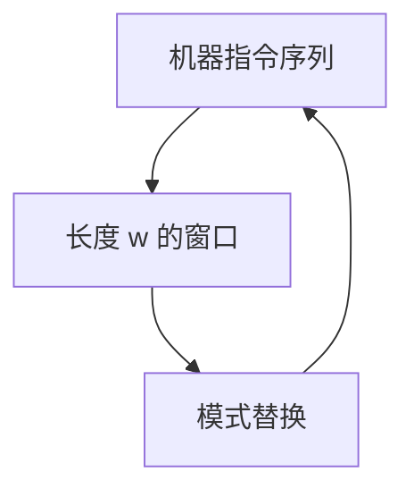

# 窥孔与窥视窗

只看相邻几条指令，用代数与控制的局部恒等替换成更短或更快的序列。

<footer>—— 据 McKeeman, Peephole Optimization, 1965；龙书第 8 章整理</footer>

上一课[溢出与重物化](/cs/spill-remat)可能留下冗余传送、比较后多余的测试、或 spill 造成的 load-store 对。本课不重着色。缺口是：**短窗口**改写——窥孔——不需要全局数据流再跑一轮。窗口滑过目标指令（或 IR），模式匹配替换。

## 问题

着色与选择各自局部最优，拼接后出现 `move r,r`、`add x,0`、跳转到下一指令、`store` 立刻 `load` 同地址。全局 CSE 可能已做过，但寄存器分配之后新的垃圾才出现。缺口是分配后的本地清理，不是再插 φ。

窗口长度常数，故线性一遍或直到无匹配。不保证全局最优；正确性靠每条规则的语义等价（含标志位）。

### 窥孔不是数据流

活跃分析看全 CFG。窥孔不求解方程，只认有限模式。有的规则需要「下一指令不是标号目标」之类的局部控制知识，仍不是不动点框架。

McKeeman 1965 命名 peephole。龙书把窥孔放在代码生成之后。本课规则举类不列工业目录。GCC/LLVM 的 InstCombine 是 IR 层同类物。

## 方法

维护长度为 $w$ 的缓冲。规则：恒等运算删除、强度削弱（移位代乘常数，仅当 ISA 有且语义同）、跳转链压缩、死传送。替换后回退窗口以免错过重叠。

[RISC-V](/cs/riscv-int-isa) 上立即数 0、伪指令展开后再窥孔，避免对伪指令与真指令各写一套还不一致。窗口不要跨基本块边界，除非能证明中间没有入口。

## 机制

与流水线：窥孔可消掉无用比较，减少控制冒险来源，但不代替分支预测。与 ABI：不要删掉为遵守调用约定而存在的保存/恢复，除非能证多余——那通常要活跃，超出纯窥孔。安全做法：窥孔不做跨调用的删保存。

替换可能缩短窗口，应再扫一遍直到稳定，但仍保持局部。

## 边界

本课不写链接器、不排指令调度算法（list scheduling）。不改 ABI。后课默认：函数已是可按约定发射的指令。下一课把物理寄存器与栈帧钉成对其他编译单元也成立的二进制接口。

## 小结

- 窥孔 = 常数窗口上的语义等价改写。
- 分配之后尤其需要；线性、不全局最优。
- 不擅自删调用保存；窗口默认不跨块。
- 出处：McKeeman, 1965；Aho et al., 龙书第 8 章。
