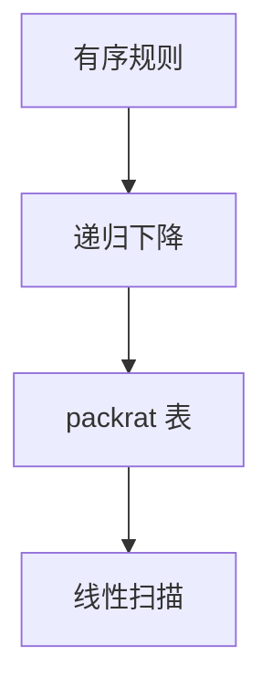

# PEG 与 packrat

有序选择不是并：先试左边，成功则右边永不发生。记忆化后线性时间，但 Peg 的语言类与 CFG 交叉而不包含。

<footer>—— 据 Ford, Parsing Expression Grammars, 2004；Ford, Packrat Parsing, 2002 整理</footer>

上一课[GLR](/cs/glr-parser)在 CFG 上保留全部推导。缺口是另一套前端习惯：**PEG**——`e1 / e2` 有序，且带 `&`/`!` 谓词。packrat：每个位置、每个非终结符只算一次，线性于输入×规则。本课钉与 CFG 的差，不把 PEG 写成「更现代的 yacc」。

## 问题

CFG 的 `|` 是并，二义来自多条同时成功。PEG 的 `/`：左枝吃掉则右枝不看。左递归在朴素 PEG 里会无限递归，需改写或特殊处理。缺口是**有序选择与谓词**，不是再填 LALR 表。

packrat 用表记住 `(i, A)` 的成败与消耗长度，避免递归下降的指数。空间 $O(n\cdot |G|)$，这是换时间的代价。

### `/` 不是 `|`

`A / A B` 永远认短的 `A`，后面的 `B` 不是「另一条合法产生式」。把 yacc 文法机械换成 PEG 会静默改变语言。最长匹配要显式写成优先长枝，或用谓词。

Ford 2004 POPL（PEG）；2002 ICFP（packrat）。PEGs 不能直接搬 CYK 的「成员 = 某非终结符推出」。本课不引用不存在的 arXiv 编号。

## 方法

手写或生成递归下降，每个解析函数对位置做记忆化。谓词 `&e` 成功不消耗；`!e` 失败则成功。词法可并进同一 PEG，空白用显式规则吃掉——与 lex/yacc 分阶段对照，不是必须合一。

工具链（如许多 PEG 生成器）默认无左递归；需要左结合表达式时用 Pratt 或循环，下一课。

## 机制

PEG 认的语言类与 CFG 不可比：有的 PEG 不是 CFG，有的 CFG 没有等价 PEG。间接左递归同样危险。错误信息：有序选择会把失败吞进左枝，诊断比 LR 的「此处期望 FOLLOW」更绕，后课错误恢复再对照。

不要用 PEG 证明 CFL 性质：泵引理对 PEG 不直接适用。本进阶课要的是实现策略，不是再开自动机层级。

## 边界

本课不写 GLL，不把 tree-sitter 的 GLR 方言说成 PEG。后课默认：PEG = 有序选择 + 可选 packrat；表达式优先级常另用 Pratt。下一课算符优先的手写分析。

无限前瞻谓词可使某些输入极慢，若未记忆化；packrat 压掉重复，压不掉「谓词每次扫很长」的常数。

## 小结

- PEG 的 `/` 有序，语言不等于 CFG 并。
- packrat 记忆化后线性，换空间。
- 不要把 yacc 文法直接当 PEG。
- 出处：Ford, 2002、2004。
