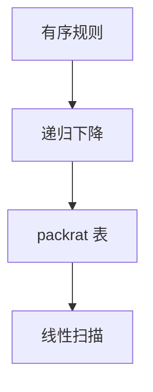
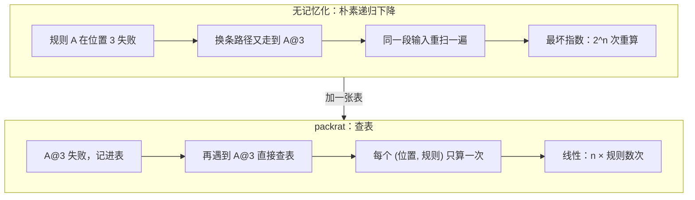

# PEG 与 packrat

有序选择不是并：先试左边，成功则右边永不发生。记忆化后线性时间，但 Peg 的语言类与 CFG 交叉而不包含。

<footer>—— 据 Ford, Parsing Expression Grammars, 2004；Ford, Packrat Parsing, 2002 整理</footer>

上一课[GLR](/cs/glr-parser)在 CFG 上保留全部推导。缺口是另一套前端习惯：**PEG**——`e1 / e2` 有序，且带 `&`/`!` 谓词。packrat：每个位置、每个非终结符只算一次，线性于输入×规则。本课钉与 CFG 的差，不把 PEG 写成「更现代的 yacc」。

## 问题

CFG 的 `|` 是并，二义来自多条同时成功。PEG 的 `/`：左枝吃掉则右枝不看。左递归在朴素 PEG 里会无限递归，需改写或特殊处理。缺口是**有序选择与谓词**，不是再填 LALR 表。

packrat 用表记住 `(i, A)` 的成败与消耗长度，避免递归下降的指数。空间 $O(n\cdot |G|)$，这是换时间的代价。

### `/` 不是 `|`

`A / A B` 永远认短的 `A`，后面的 `B` 不是「另一条合法产生式」。把 yacc 文法机械换成 PEG 会静默改变语言。最长匹配要显式写成优先长枝，或用谓词。

数字实例：想让规则认「A 或 A B」，CFG 里写 `A | A B` 两种都试得通；PEG 里必须把长的写前面：`A B / A`。如果写成 `A / A B`，输入 "AB" 时左枝吃掉 "A" 就宣布成功，"B" 变成没人管的残留——解析不报错，但语言已经悄悄变了。

Ford 2004 POPL（PEG）；2002 ICFP（packrat）。PEGs 不能直接搬 CYK 的「成员 = 某非终结符推出」。本课不引用不存在的 arXiv 编号。

## 方法

手写或生成递归下降，每个解析函数对位置做记忆化。谓词 `&e` 成功不消耗；`!e` 失败则成功。词法可并进同一 PEG，空白用显式规则吃掉——与 lex/yacc 分阶段对照，不是必须合一。

```mermaid
flowchart TD
  PEG["有序规则"] --> RD["递归下降"]
  RD --> MEM["packrat 表"]
  MEM --> LIN["线性扫描"]
```

工具链（如许多 PEG 生成器）默认无左递归；需要左结合表达式时用 Pratt 或循环，下一课。

## 机制

PEG 认的语言类与 CFG 不可比：有的 PEG 不是 CFG，有的 CFG 没有等价 PEG。间接左递归同样危险。错误信息：有序选择会把失败吞进左枝，诊断比 LR 的「此处期望 FOLLOW」更绕，后课错误恢复再对照。

```mermaid
flowchart TD
  subgraph NO["无记忆化：朴素递归下降"]
    P1["规则 A 在位置 3 失败"] --> P2["换条路径又走到 A@3"]
    P2 --> P3["同一段输入重扫一遍"]
    P3 --> P4["最坏指数：2^n 次重算"]
  end
  subgraph YES["packrat：查表"]
    M1["A@3 失败，记进表"] --> M2["再遇到 A@3 直接查表"]
    M2 --> M3["每个 (位置, 规则) 只算一次"]
    M3 --> M4["线性：n × 规则数次"]
  end
  NO -->|"加一张表"| YES
```

这张图回答的问题是：packrat 靠什么把指数压成线性？朴素递归下降里，同一条规则在同一次失败后还会被不同路径反复重试，重试次数指数膨胀；packrat 给每个「位置 × 规则」的组合开一行表，算过一次成败与消耗长度就永久复用。组合数只有 $n \times |G|$，总时间随之变线性——代价是这张表要占 $O(n\cdot|G|)$ 空间。

直觉类比：packrat 表就像做题时打的草稿——同一个「辅助线 + 已知条件」组合推过一次，就把结论抄在边上；之后不论哪条解题路径再走到这一步，看一眼草稿直接用，不再从头推。表就是那张按「位置 × 规则」编号的草稿纸。

不要用 PEG 证明 CFL 性质：泵引理对 PEG 不直接适用。本进阶课要的是实现策略，不是再开自动机层级。

## 边界

本课不写 GLL，不把 tree-sitter 的 GLR 方言说成 PEG。后课默认：PEG = 有序选择 + 可选 packrat；表达式优先级常另用 Pratt。下一课算符优先的手写分析。

无限前瞻谓词可使某些输入极慢，若未记忆化；packrat 压掉重复，压不掉「谓词每次扫很长」的常数。

常见误区：以为「packrat 是线性时间，所以 PEG 解析器总是最快的」。线性只封顶不保证快——表本身要花内存与查表时间，对很小的输入，一张 packrat 表的开销可能超过它省下的重算；另外左递归文法在 PEG 里干脆跑不终止。选解析方案仍要看文法形状，不是名字带「线性」就赢。

## 小结

- PEG 的 `/` 有序，语言不等于 CFG 并。
- packrat 记忆化后线性，换空间。
- 不要把 yacc 文法直接当 PEG。
- 出处：Ford, 2002、2004。
