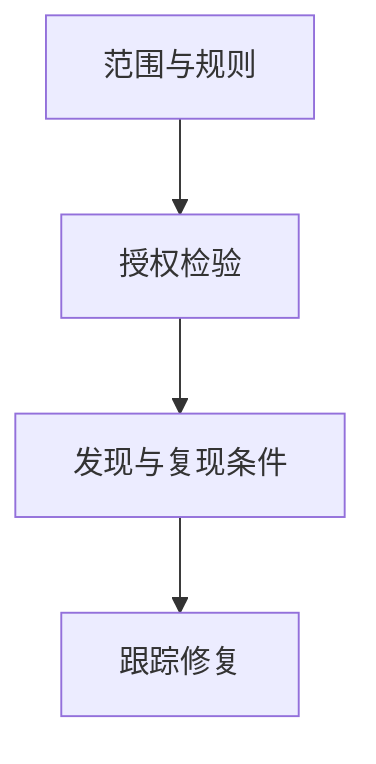

# 渗透测试方法论

授权的渗透测试检验控制是否在真实路径上有效：范围、规则、证据、修复跟踪。它不是未授权攻击的许可证，也不是「越深越专业」的竞赛。

<footer>—— 据 PTES；NIST SP 800-115；OSSTMM 点名；对照法律授权</footer>

## 定位

上一课[ATT&CK](/cs/mitre-attack)给覆盖语言。缺口是**授权检验**：范围书、禁止事项、报告。本课讲方法论，不提供未授权利用步骤或 PoC 武器化。

后课默认已经读完本课钉下的合同，只补差，不从该领域第一性原理重开。

## 问题

无范围则测到生产事故。缺口是：书面授权、数据如何处理、是否允许社会工程、如何报告。与红队后课的持续对抗区分：渗透测试常有明确起止。

### 发现即停

触及真实个人数据或安全开关应升级，而不是继续挖。

SP 800-115。课程禁止把本课当黑客教程。红蓝下一课是组织对抗。

## 方法

阶段：侦察（仅范围内）、发现、验证控制、报告、复测。证据要可复现给修复方，但对外报告脱敏。

图中节点是本课的机制骨架；课程不把图展开成可运行的攻击步骤。

## 机制

检验服务完整与授权控制。红蓝下一课把频率与对抗性提高，仍要授权。

前提写进合同之后，游戏外的误用只当失败模式点名，不在本课写成操作程序。

## 边界

不写未授权攻击。红蓝对抗下一课。

## 小结

- ATT&CK 是词典；渗透测试是授权检验。
- 范围与升级规则先于技术。
- 报告为了修复，不是为了炫耀链。
- 下一课红蓝对抗。
- 出处：NIST SP 800-115；PTES。
