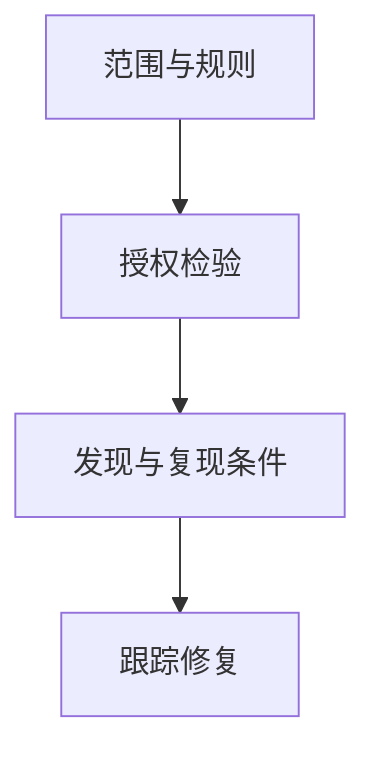
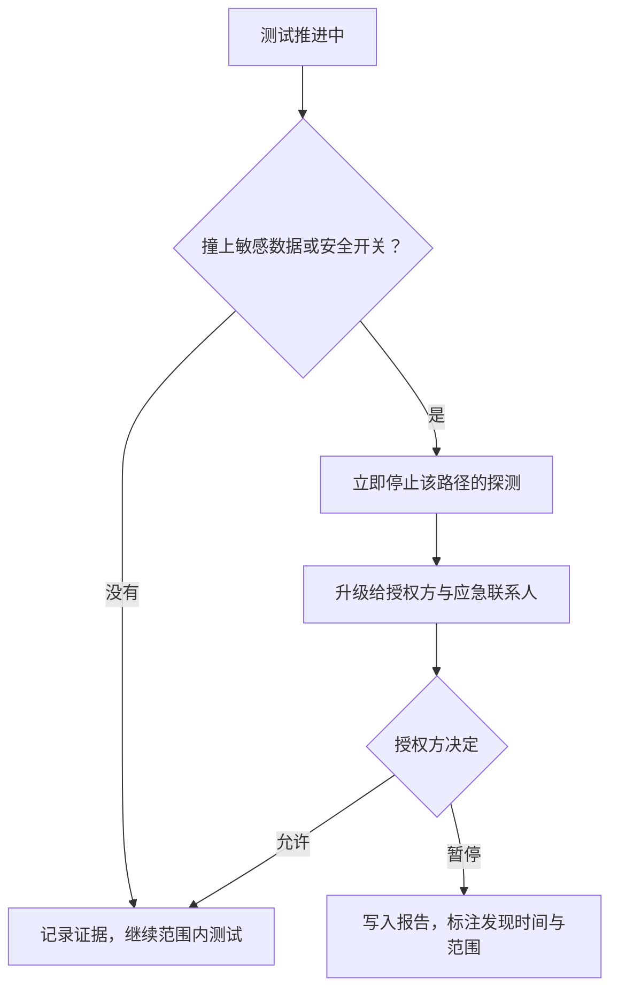

# 渗透测试方法论

授权的渗透测试检验控制是否在真实路径上有效：范围、规则、证据、修复跟踪。它不是未授权攻击的许可证，也不是「越深越专业」的竞赛。

<footer>—— 据 PTES；NIST SP 800-115；OSSTMM 点名；对照法律授权</footer>

上一课[ATT&CK](/cs/mitre-attack)给覆盖语言。缺口是**授权检验**：范围书、禁止事项、报告。本课讲方法论，不提供未授权利用步骤或 PoC 武器化。

后课默认已经读完本课钉下的合同，只补差，不从该领域第一性原理重开。

## 问题

无范围则测到生产事故。缺口是：书面授权、数据如何处理、是否允许社会工程、如何报告。与红队后课的持续对抗区分：渗透测试常有明确起止。

### 发现即停

触及真实个人数据或安全开关应升级，而不是继续挖。

SP 800-115。课程禁止把本课当黑客教程。红蓝下一课是组织对抗。

## 方法

阶段：侦察（仅范围内）、发现、验证控制、报告、复测。证据要可复现给修复方，但对外报告脱敏。

「侦察」翻译成大白话：在动手碰任何系统之前，先把「这次允许看哪些」盘点清楚——范围书里写的域名、网段、应用清单就是地图边界。这一步的意义一半在找目标，另一半在划红线：清单之外的东西，扫一下都算越界。

```mermaid
flowchart TD
  SOW["范围与规则"] --> TEST["授权检验"]
  TEST --> REP["发现与复现条件"]
  REP --> FIX["跟踪修复"]
```

## 机制

检验服务完整与授权控制。红蓝下一课把频率与对抗性提高，仍要授权。

```mermaid
flowchart TD
  STEP["测试推进中"] --> CHECK{"撞上敏感数据或安全开关？"}
  CHECK -->|"没有"| GO["记录证据，继续范围内测试"]
  CHECK -->|"是"| STOP["立即停止该路径的探测"]
  STOP --> UP["升级给授权方与应急联系人"]
  UP --> DEC{"授权方决定"}
  DEC -->|"允许"| GO
  DEC -->|"暂停"| END["写入报告，标注发现时间与范围"]
```

这张图回答的问题是：「发现即停」在实际流程里是怎么嵌入的？渗透测试不是闷头跑完清单——每一步都要过一道判断：触及真实个人数据、踩到安全开关（比如触发了生产环境的防护机制）就立即停手，改为升级给授权方，由他们决定继续还是收尾。测试方的判断权止步于升级动作，这是授权合同的一部分。

为什么重要：证据要「可复现给修复方」——工程师拿到「在测试环境 X、用参数 Y 重放即触发」这样的描述才能定位修复；而对外报告要脱敏，防止报告本身变成攻击说明书。同一份发现，对内是施工图，对外是摘要，两套口径缺一不可。

## 边界

不写未授权攻击。红蓝对抗下一课。

常见误区：以为「通过了渗透测试 = 系统是安全的」。渗透测试只检验测试时、测试范围内的路径——它更像一次体检而不是健康保证：今天没查出问题，不代表明天新功能上线后没有。所以成熟团队把它做成周期性复测加上持续监控，而不是一锤子买卖。

## 小结

- ATT&CK 是词典；渗透测试是授权检验。
- 范围与升级规则先于技术。
- 报告为了修复，不是为了炫耀链。
- 下一课红蓝对抗。
- 出处：NIST SP 800-115；PTES。
