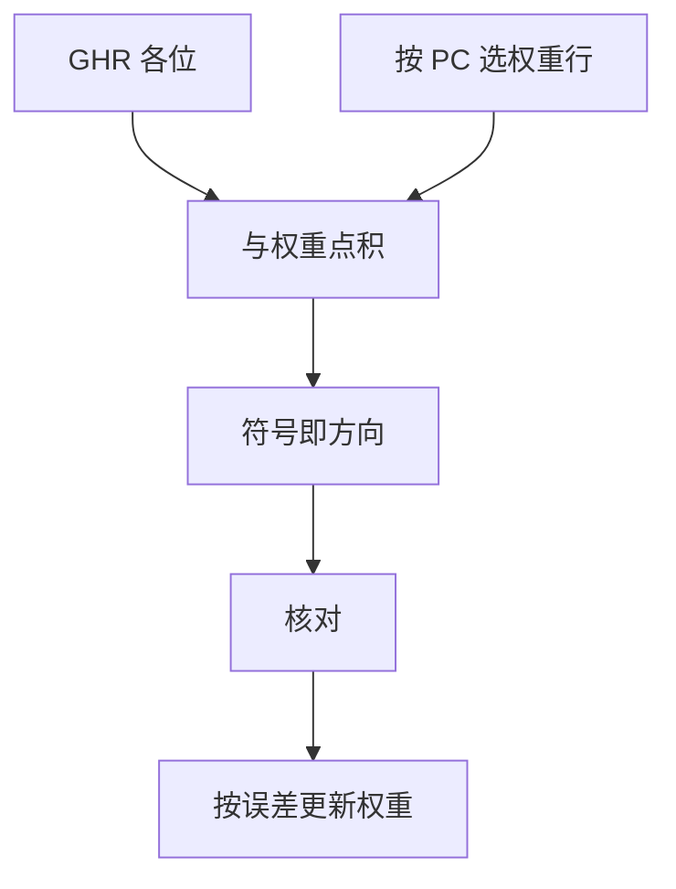

# 感知器预测器

把全局历史的每一位当成特征，用一组权重做点积；阈值为正猜跳、为负猜不跳，训错则按历史加减权重。

<footer>—— 据 Jiménez and Lin, Dynamic Branch Prediction with Perceptrons, HPCA 2001 整理</footer>

[上一课](/cs/tage-predictor)用若干张表记住「这一段历史出现过」。历史是索引，不是特征：两位计数器无法表达「第 3 位与第 17 位同时为 1 才跳」这种可加结构。本课不重讲几何标签。缺口是：**把 GHR 当成向量，用感知器做线性判别**，专打 TAGE 也难压缩的线性相关。

## 问题

有一类分支：方向近似于若干个更早分支的异或或加权和（编译器展开后的复合条件）。PHT 要把每种 0/1 模式各占一项才能学会；历史一长，项数 $2^h$。若真实分界面近似超平面，用 $h$ 个权重就够。缺口不是再加一张更长的 TAGE 表，而是**点积 + 在线训练**。

Jiménez 与 Lin 借用 Rosenblatt 感知器：输入是 GHR 各位（及常数偏置），输出符号即方向。它不是多层网络，本课不把它写成深度学习。

训练规则：预测错，或点积绝对值小于饱和阈值时，对每个 $x_i=1$ 的权重向正确方向加一，对 $x_i=0$ 减一。权重有界以防溢出。

## 方法

按 PC 选一行权重 $\mathbf{w}$（可多表散列）。计算 $y = w_0 + \sum_i w_i x_i$，其中 $x_i\in\{+1,-1\}$ 来自 GHR。$y\ge 0$ 预测成功。核对后按上述规则更新该行。为实现，点积可在移位 GHR 时用加减累加，不必每拍做 $h$ 次乘。

与 gshare/TAGE 可竞赛：选择器看谁最近更准。感知器擅长线性可分，TAGE 擅长不规则模式；互补正是 McFarling 锦标赛那一套，只是一路换成权重。

## 机制

CPI 公式不变，改的是误预测率的来源：线性分支不再吃指数级 PHT。代价是每拍点积的延迟与权重 SRAM 端口。历史越长，关键路径越差，这与 TAGE 用几何表换索引延迟是另一笔交易。

权重行同样会被别名：不同 PC 散列到同一行会互相拆台，可用部分标签或更细散列缓解，思想同 TAGE，本课不另开一张几何权重表。

## 边界

本课不把多层感知器、也不把神经网络分支预测器铺开。间接目标不能用正负号表示，仍走 BTB / 后课间接预测。训练必须在核对后（或可回滚），推测更新会污染权重。

后课默认：方向预测有三条成熟路——饱和表、TAGE、感知器。目标地址仍可能每次不同，那是下一课间接分支。

## 小结

- 感知器用 GHR 特征做线性判别，项数随 $h$ 线性而非 $2^h$。
- 与 TAGE 互补：不规则模式仍靠带标签的表。
- 间接跳转的目标集合是下一课的缺口。
- 出处：Jiménez and Lin, *HPCA*, 2001。
