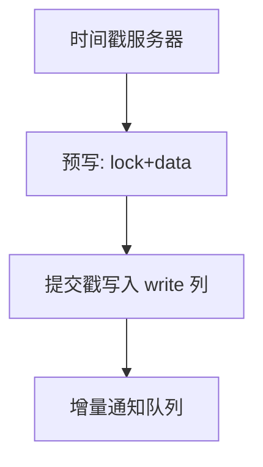

# Percolator

在无跨行事务的 Bigtable 上，用锁列、写意图与一次提交时间戳，把多行更新收成客户端驱动的 2PC 变体。

<footer>—— 据 Peng and Dabek, Large-scale Incremental Processing Using Distributed Transactions and Notifications, OSDI 2010</footer>

[上一课](/cs/distributed-join-shuffle)搬运连接数据。本课不 shuffle。缺口是宽列存储默认单行原子：索引与网页库要跨行事务。Percolator 在单元格上加 lock/write/data 列，客户端做两阶段：预写抢锁写意图，提交打时间戳。增量处理（文档更新通知）叠在事务上。

## 问题

Bigtable 行原子、跨行无。搜索索引更新要同时改多行。缺口是**把 2PC 状态机编码进表**，不用独立事务管理器进程（协调器是客户端+时间戳服务器）。时间戳服务器给单调戳，类似 TSO。锁超时与崩溃：扫 lock 列清理。

与 Calvin：Percolator 悲观锁+戳，非全局定序全部事务。与 Spanner：无 TrueTime 提交等待，SI 风格。

Peng and Dabek, OSDI 2010，Google。本课机制。后续 Cockroach 等受 TSO+锁启发。

## 方法

Get/Prepare/Commit 协议：读带快照戳；写先对行写 lock 与新 data；全部预写成功则提交戳写入 write 列，清 lock。冲突：发现 lock 则等或 abort。通知：提交后把脏键放入队列做增量作业。

隔离：快照读 + 写写冲突检测，近似 SI，写偏斜按产品是否额外检测。

## 机制

性能：每行多列、多次 RPC，热点行锁。适合吞吐增量，不适合超短 OLTP 延迟。恢复：无独立 undo 日志，意图行即状态。WAL 在 Bigtable 层。

与 CDC：通知队列是内部 CDC。逻辑复制课的下游思想在此是同一公司流水线。

## 边界

本课不讲 TrueTime。也不把 Percolator 当 SQL 优化器。分布式死锁后课：锁在表里，等待图跨客户端。

后课默认：可在 KV/宽列上叠客户端 2PC。Spanner 与 TrueTime：用时钟不确定区间给提交时间，实现外部一致。

把锁塞进数据表，协调器失败变成「行上残留 lock」的清理问题。

## 小结

- Percolator 用锁列与提交戳在 Bigtable 上做跨行事务。
- 时间戳服务器+客户端协议；适合增量，不适合超低延迟。
- Spanner 与 TrueTime 下一课。
- 出处：Peng and Dabek, OSDI 2010。
