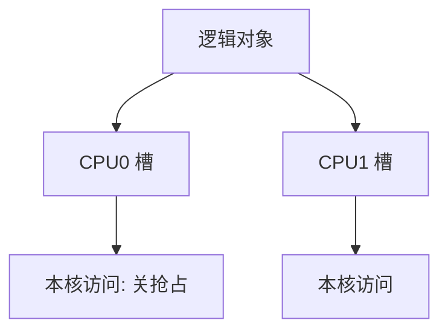

# per-CPU 数据

每颗 CPU 一份副本，访问时关抢占或用本 CPU 的偏移，于是更新不必与全世界抢同一把锁。

<footer>—— 据 Love, Linux Kernel Development；Bovet and Cesati 整理</footer>

[上一课](/cs/kernel-preempt)允许在内核路径中途被切走，也允许被迁移到另一核。全局计数器若每拍都原子加，多核会打同一 cache 行。[中断亲和](/cs/irq-affinity)已经把 IRQ 往核上收。缺口是：把统计、缓冲槽、软中断 pending 做成 **per-CPU**——逻辑上一个对象，物理上每核一份。本课只钉这份布局与访问纪律，不引入进程映像。

## 问题

共享全局锁保护一个 `int` 计数，正确但不可扩展。每 CPU 一份：本核读写自己的槽，无需锁，前提是执行期间**不会被抢占到别的核**，或迁移时把「当前 CPU」的寻址做对。缺口不是新的硬中断，而是分配器给出每核偏移，访问用 `this_cpu_*` 一类原语，并在需要时关抢占。

读总和要把各 CPU 槽加起来，快照不必瞬间一致；这是统计的代价。要强一致总和，仍得逐核关或用更重的同步。

## 方法

启动时为每个 CPU 分配同构的一块：统计、页分配缓存、软中断状态。访问：先关抢占（或已经在 IRQ 上下文、天然不迁移），再按当前 CPU id 取槽。跨核要碰别人的槽时，用 IPI 或接受锁——per-CPU 不是「永远无锁」，只是**本核热路径无锁**。汇总在定时器或 /proc 读取时做。

与[分页](/cs/paging-vm)无关：这是内核虚拟地址里的静态或动态 per-CPU 区，不是用户页表。

## 机制

per-CPU 把锁争用换成迁移纪律。打开内核抢占后，漏了关抢占会在槽 A 上加一半、跑到核 B 再写槽 B，计数撕裂。NMI 若也要记账，槽还须对 NMI 安全，或使用单独的 NMI 计数。软中断 pending 位天然 per-CPU，与上一课的上下文模型一致。

后课的进程是跨 CPU 迁移的对象；它的 PCB 不是 per-CPU 的。本课只把「核本地内核状态」交出去。

## 边界

本课不把所有 `DEFINE_PER_CPU` 变量列清单，不写 false sharing 的缓存行对齐微优化全书。用户态的线程局部存储是更后的 TLS 课，对象是进程内线程，不是 CPU。

后课默认：内核统计与核本地队列可以无锁。内核要切换的**用户状态包**叫什么、里面有什么，下一课讲[进程映像](/cs/process-image)。

## 小结

- per-CPU：每核一份，本核热路径免全局锁。
- 访问须关抢占或处于不迁移上下文。
- 用户进程映像是下一课，不是 per-CPU 对象。
- 出处：Love, *LKD*；Bovet and Cesati。
