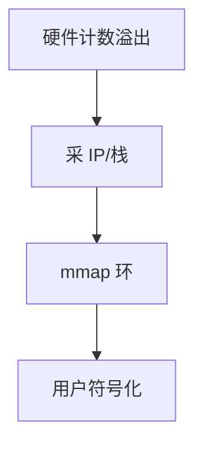

# perf 采样

perf 用 PMU 周期或事件溢出中断采样 IP，再靠 DWARF/帧指针归因到函数；也可记录 tracepoint 与 probe。

<footer>—— 据 Linux perf_events 文档；Intel/ARM PMU；[cyclictest](/cs/latency-measurement) 为延迟对照</footer>

[kprobe](/cs/kprobes-uprobes) 是点。[printk](/cs/printk-logging) 是线。缺口是 **统计采样**：perf_events ABI、ring mmap、与开销。

## 问题

`perf record -F`：每 N 个 cycle 采一个栈。缺口：skid；off-CPU 要用 sched 事件；内核与用户栈、[KPTI](/cs/kpti-os) 下的解析。本课不把全部 PMU 事件当词典。

perf_event_open 是系统调用。cgroup 可限制谁能用 PMU。对象是性能计数，不是公平 Jain。

## 方法

编程 PMU → 溢出 IRQ → 拷栈到 mmap 环 → 用户解析符号。对照 [NAPI](/cs/napi)：都是中断采样思想。对照 [blkio](/cs/blkio-cgroup)：I/O 统计另一条。对照 ASan：一个正确性，一个速度。

## 机制

采样把「CPU 时间花在哪」变成直方图，是优化的默认入口。它改变被测物（probe effect）。不要写成火焰图产品教程（那是展示）。与 [EAS](/cs/eas-scheduling)：freq 变则 cycle 含义变。

无帧指针且无 DWARF 则栈烂。

实现上：PEBS 减 skid 但仍不是指令精确。off-CPU 分析要 sched:sched_switch。无帧指针时要 DWARF 展开，内核与用户都要对应 debuginfo。 读法上只引用[上一课](/cs/kprobes-uprobes)的结论，不把对象换成训练推理或限价簿。

本课在操作系统进阶的「安全、启动与调试 / 观测与调试」课序里，对象是 **perf 采样**。

- 先修只引用，不重导：上一课的结论当公理，本课只补差。
- 五栏不吞并：不把本课写成大模型训练/推理，也不写成限价簿或权重量化。
- 文献用 OSTEP、McKusick、内核文档与具名会议论文；不发明 arXiv 编号。

## 边界

本课不引入所有 PEBS 细节。不保证虚拟化 PMU 真实。下一课可编程观测：eBPF。

版本字段会变，课序钉的是机制对象「perf 采样」，不是某一主线内核的结构体名。
后课默认：PMU 采样可归因热点。eBPF 观测程序，下一课。

## 小结

- perf 用 PMU 或软件事件采样栈。
- 开销与 skid 要心里有数。
- eBPF 观测是下一课。
- 出处：perf_events；内核 perf 文档。
