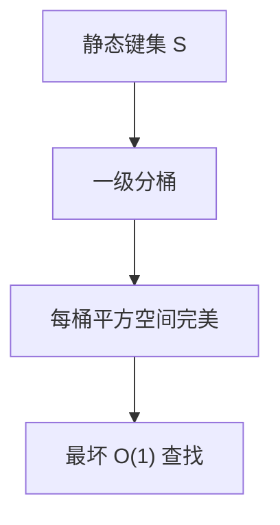

# 完美散列

键集已知且不再变：可以造一张没有碰撞的表，查找最坏常数次探测。

<footer>—— 据 Fredman, Komlós and Szemerédi, Storing a Sparse Table with O(1) Worst Case Access Time, JACM 1984；Cormen, Leiserson, Rivest and Stein 整理</footer>

[上一课](/cs/universal-hashing) 保证期望，单次仍可能撞。[布谷](/cs/robin-cuckoo) 最坏查找常数但插入可能重建。静态只读字典（保留字、协议码点）可以预处理到零碰撞。本课不换种子对抗。缺口是完美散列：FKS 两级，或 CHD 等实践方案点名。

## 问题

静态集 $S$，$|S|=n$，成员查询。完美：$h$ 在 $S$ 上单射。最小完美：值域也是 $n$ 槽。FKS：一级 $h$ 把键分桶，桶 $i$ 大小 $n_i$，二级表长 $\Theta(n_i^2)$ 使桶内完美（期望二级空间合计 $O(n)$）。缺口是**用空间换掉运行时碰撞**，查找两次散列最坏 $O(1)$。

Fredman–Komlós–Szemerédi, *JACM*, 1984。实践 gperf、CHD、BBHash 等，本课不把压缩完美散列论文逐篇列成百科。

## 方法

构造：反复抽通用 $h$ 直到一级桶的 $\sum n_i^2=O(n)$，每桶再抽二级 $h_i$。失败重抽，期望尝试常数。查询：一级下标，二级下标，比较键（避免假命中）。

与开放寻址：完美无墓碑、无聚集，但不能插入新键除非重建。与布隆：完美无假阳性，但必须存键或确认比较。

## 机制

空间 $O(n)$ 词级；最小完美更省槽但构造更烦。更新：任意插入可能破坏单射，合同是静态。通用族保证能抽到好 $h$。

槽位增减、缓存分布式：下一课一致性哈希，问题从「碰撞」换成「谁负责这个键」。

## 边界

本课不要求交 FKS 实现作业。动态完美散列存在但复杂，主干不提前。过滤器允许误差，后面草图课再放宽。

后课默认：静态只读无碰撞用完美散列。节点增减时的键映射用一致性哈希。

## 小结

- 完美散列：静态集最坏 $O(1)$，FKS 两级期望线性空间。
- 不能廉价插入。
- 分布式槽重映射是一致性哈希。
- 出处：Fredman, Komlós and Szemerédi, *JACM*, 1984；Cormen et al.。
