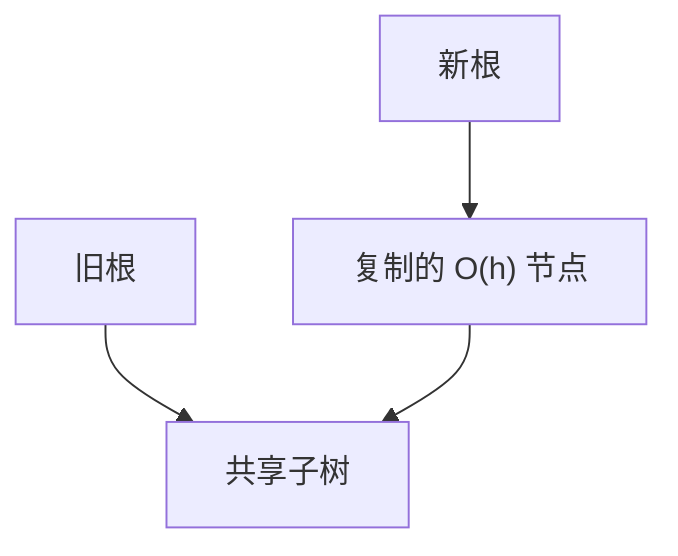

# 持久化与路径复制

更新不覆盖旧节点：复制根到修改点的路径，其余子树指针共享。旧根仍是完整的旧版本。

<footer>—— 据 Driscoll, Sarnak, Sleator and Tarjan, Making Data Structures Persistent, JCSS 1989；Okasaki, Purely Functional Data Structures 整理</footer>

[上一课](/cs/t-digest-quantile) 收束近似摘要。[可持久化线段树](/cs/persistent-segment-tree) 已在区间树上做过一遍；[HAMT](/cs/hamt) 与 [Rope](/cs/rope-structure) 也用了共享。本课把方法从特例抽出来：部分持久 / 完全持久 / 函数式，以及路径复制的代价。

## 问题

版本控制、回溯、函数式语义要「改完仍能读旧」。fat node 在节点里存时间线，完全持久强、实现烦。路径复制：树（或 DAG 指针结构）每次更新 $\Theta(h)$ 新节点。缺口是**一般树结构的版本 = 根指针**，以及何时必须 fat node（有向图入度大、路径不唯一）。

Driscoll et al., *JCSS*, 1989。Okasaki 强调惰性与摊还在函数式堆/队列上的用法。本课先命令式复制，惰性下一课队列再用。

## 方法

只读操作沿当前根，不写。写入：自叶向上 `new`，孩子指针指向旧或新。几何树、BST、线段树同一套路。可并堆破坏性 meld 会弄丢旧堆；函数式 meld 复制路径，接[可并堆](/cs/mergeable-heap) 合同但表示不同。

空间：$m$ 次更新 $O(m h)$。不要原地改已共享节点。

## 机制

引用计数或 GC 回收无根可达的版本。多版本并发控制在数据库里同构，本课只钉内存结构。并发写同一逻辑树需 CAS 根或后课无锁，路径复制本身不解决线性化。

缓存无关布局下一课换的是扫描顺序，与版本正交；但可组合。

## 边界

本课不把全部 DSST 动态树持久化写完。图结构共享比树难。函数式 FIFO 有「倒栈」技巧，下一课专收，避免在这里把队列摊还证完。

后课默认：树的不可变更新用路径复制。函数式队列用双栈。

## 小结

- 路径复制：新版本 $O(h)$ 节点，旧根只读。
- 共享子树；禁止写共享节点。
- 下一课把该方法用在 FIFO 上。
- 出处：Driscoll et al., *JCSS*, 1989；Okasaki。
