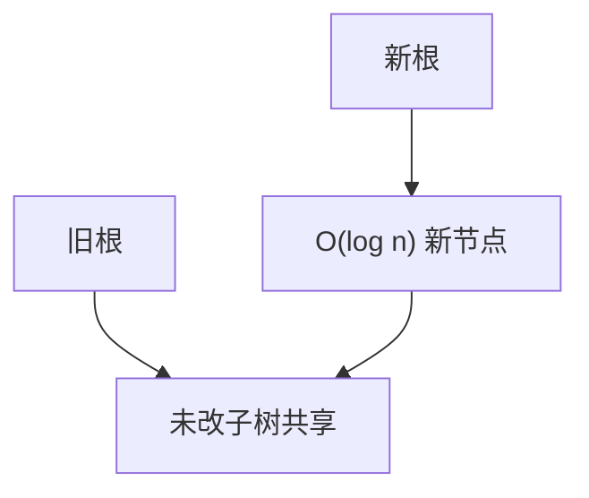

# 可持久化线段树

每次修改只复制根到叶的 $O(\log n)$ 个新节点，旧根仍指向未改的子树；版本是一条根指针。

<footer>—— 据 Driscoll, Sarnak, Sleator and Tarjan, Making Data Structures Persistent, JCSS 1989；Okasaki, Purely Functional Data Structures 整理</footer>

[上一课](/cs/segment-tree-lazy)让同一棵树在更新后丢掉旧聚合。若还要问「第 $k$ 次修改之前 $[l,r]$ 的和」，就得把历史留下来。本课不重讲懒标记复合。缺口是可持久化（主席树常用形态）：路径复制，每版本 $O(\log n)$ 新节点。

## 问题

函数式与回溯、整体二分、区间第 $k$ 小，都需要多份数组快照。整表复制每次 $\Theta(n)$。缺口是：**共享未改子树**。修改 $A[i]$：新建叶与祖先，左右孩子指针能指旧节点的就指旧的。每个版本一个根。查询带着根走，语义与普通线段树相同，只是读的是那一版。

Driscoll et al. 区分部分/完全持久与函数式（只出新版本）。主席树是函数式线段树的竞赛名，本课用路径复制说话。

## 方法

建版本 $0$ 与建普通树相同。从版本 $v$ 改点 $i$ 得版本 $v+1$：递归时若区间不含 $i$ 则返回旧节点指针；含 $i$ 则 `new` 一个节点，一边接递归结果，一边接旧孩子。空间对 $m$ 次修改是 $O(n+m\log n)$。查询 $O(\log n)$，不写回。

懒标记与可持久化可以同时做，但标记下传会被迫复制孩子，常数与正确性更烦；本课默认点修可持久化，不把懒标持久化写完。

## 机制

旧根可达的节点永不原地改，否则历史被污染。这要求分配新节点，不能在数组线段树里覆写 $2u$。动态开点：若值域大、实际点少，节点按需 `new`，同一套复制。区间第 $k$ 小：权值线段树每个前缀一个版本，两点根相减得区间频次——那是应用，机制仍是版本差。

与后课[路径复制](/cs/persistent-path-copy)同一思想，本课先在线段树上落地。

## 边界

本课不把并查集可持久化、或 fat node 的完全持久写进来。空间随版本线性涨，不能当无限日志。并发多写者抢同一版本链需要后课无锁/持久化另一套语言。

后课默认：要历史区间聚合，持有旧根。单次扫描上的近邻结构，用单调栈队列。

## 小结

- 可持久化线段树：改路径复制，$O(\log n)$ 新节点/版本。
- 旧根只读；原地写会毁掉历史。
- 下一缺口是线性扫描里的近邻，不是更多版本。
- 出处：Driscoll et al., *JCSS*, 1989；Okasaki。
