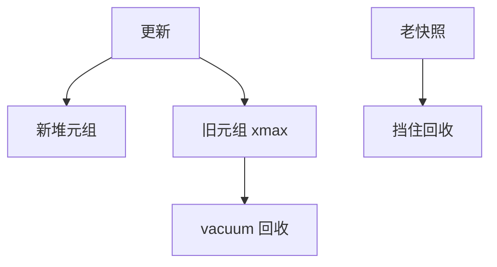

# Postgres 元组版本与 vacuum

更新写新堆元组、旧元组打 xmax；vacuum 在所有快照都看不见后回收空间，冻结避免事务 id 回卷。

<footer>—— 据 PostgreSQL MVCC 文档；Bernstein 多版本；Gray</footer>

[上一课](/cs/undo-redo-doublewrite)把 InnoDB undo 链与堆版本对照。本课专钉 Postgres：没有 undo 表空间当主路径，行版本就在堆上。主干 [MVCC](/cs/mvcc) 已给可见性直觉；进阶要 **vacuum、冻结、膨胀**，否则对照课只停在口号。

## 问题

插入：新元组 xmin=当前 xid。删除：xmax=当前 xid，行还在。更新：删+插（或 HOT 更新若索引列不变、同页有空）。读者按快照比较 xmin/xmax。缺口是垃圾：死元组占页，索引仍可能指它们直到清理。VACUUM：扫堆，回收死元组，修剪索引，更新冻结 xid，刷新统计（常一起 ANALYZE）。

长事务/槽位：老快照挡住回收，表膨胀。这是 MVCC GC 课的 Postgres 实例，本课先给机制。

HOT（Heap Only Tuple）减少二级索引维护。冻结把老 xmin 标成永远可见，防 xid 回卷。本课不把 autovacuum 参数表当理论。

## 方法

autovacuum 按死元组比例唤醒。手动 vacuum 锁弱于全表 rewrite。VACUUM FULL 重建表，短锁重。BRIN/可见性映射：全可见页可跳过 vacuum 扫，这是 zone 思想在 GC 上。

复制：hot_standby 查询在备库持快照，同样可挡主库回收若用反馈。冲突后课。

## 机制

与 2Q：死空间让扫描读更多页，污染更重。与计划：膨胀后统计若未更新，代价估错。与 WAL：vacuum 写大量 redo，检查点与复制延迟上升。

InnoDB 对应 purge undo；名字不同，都是「最小快照之后的版本可丢」。

## 边界

本课不讲聚簇回表。也不把 vacuum 当 LSM compaction——相似都是回收，结构不同。xid 回卷是运维事故，机制是冻结。

后课默认：堆引擎必须持续 vacuum；长快照是膨胀源。聚簇索引与回表：二级索引如何找到聚簇行。

可见性映射让 vacuum 与扫描跳过全可见页，是跳过索引的 GC 亲戚。

## 小结

- Postgres 版本在堆上；vacuum 回收死元组并冻结 xid。
- 长快照导致膨胀；HOT 减少索引维护。
- 聚簇索引与回表下一课。
- 出处：PostgreSQL MVCC；Bernstein；Gray。
