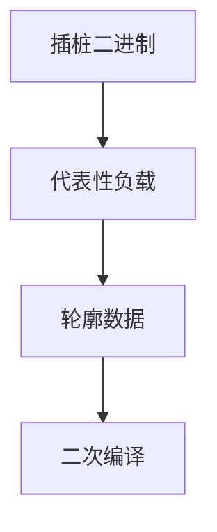

# PGO

轮廓指导优化：用代表性运行的边计数、函数热度来选内联、展开、布局与推测。静态启发是没有轮廓时的退路。

<footer>—— 据 Pettis and Hansen, Profile Guided Code Positioning；Chang, Mahlke and Hwu 内联；龙书 8.7 整理</footer>

上一课[自然循环](/cs/natural-loops)给出循环结构，但不知转几圈。缺口是**动态频率**：PGO（profile-guided optimization）。插桩或采样得边权重，第二次编译使用。本课钉工作流与偏差，不写 LTO 的全程序合并——下一课二者常一起。

## 问题

静态：循环当「热」、调用当「一次」。错。PGO：`branch_weights`、函数 entry count。决策：热函数多内联、热循环多展开、热边落在 fall-through。缺口是**把计数变成 IR 元数据**，不是识别回边。

采样 PGO（AutoFDO）用 perf 映射回源/IR，插桩少，精度与符号相关。

### 轮廓不是证明

训练集偏则优化偏。必须仍可靠：不能因「从未走到」就删有副作用的路径，除非语言允许（有的语言对未定义的冷路径更激进——危险）。

Pettis–Hansen 1990 代码布局。Hwu 组的 IMPACT。LLVM/GCC `-fprofile-generate/use`。本课不把机器学习启发式当文献核心。

## 方法

一代：插桩编译、跑负载、合并 `.profraw`。二代：读轮廓，标注 CFG 边，跑内联/展开/布局/推测（有的 JIT 用同一思想）。校验：源变了则轮廓失效，要降级。

与值范围：PGO 可给常见值，用于推测（带检查）。失败路径仍正确。

## 机制

间接调用：轮廓给目标分布，去虚+内联。布局：把热块排在一起减 i-cache 与分支惩罚。不要用错误映射的采样去移动块。

多进程合并计数要原子或离线 sum。

## 边界

本课不写完整 AutoFDO 流水线。后课默认：热度驱动启发，语义仍靠静态可靠。下一课 LTO：轮廓跨 TU 更有用。

也不把 PGO 当用户画像隐私课。

## 小结

- PGO：运行计数指导内联、展开、布局、推测。
- 训练偏差会改性能，不应改可靠语义。
- 与循环树、调用图一起用。
- 出处：Pettis and Hansen；Chang/Mahlke/Hwu；龙书。
