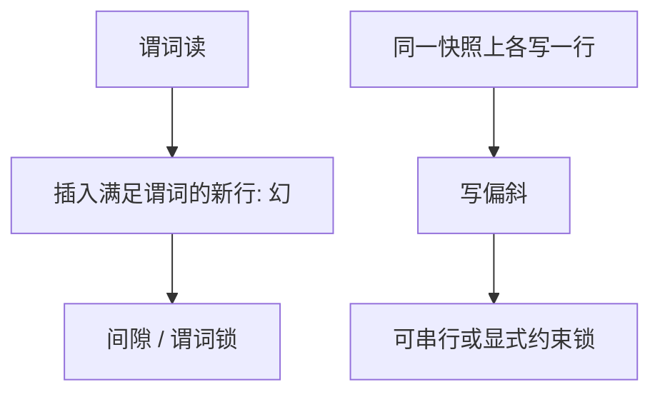

# 幻读与写偏斜

谓词读的集合里后来钻进新行，是幻读；两个事务各更新对方读过但自己没写的那一半，是写偏斜。

<footer>—— 据 Eswaran 对谓词锁；Berenson et al. 对写偏斜；Gray</footer>

[上一课](/cs/snapshot-isolation)给出 SI。本课不重做提交冲突。缺口是两种「点项锁看不见」的现象：幻读——范围扫描后插入满足谓词的新行；写偏斜——SI 下各写各的行，合起来违反不变量。后课隔离级别用这些异常当刻度。

## 问题

[前向与后向冲突](/cs/rw-wr-ww) 默认对象是已有元组。谓词读的对象是集合。插入是对集合的写，与先前的谓词读冲突，却没有 rid 可锁——除非间隙锁/谓词锁。SI 的快照让读稳定，但仍允许两名事务基于同一快照各改一行，提交后总和破坏约束。缺口是**命名这两种缝**。

写偏斜不是丢失更新：丢失更新是 ww 同一项。写偏斜是两个 ww 不重叠，但有 rw 环。本课只讲机制，不给利用步骤。

## 方法

幻读防御：可串行隔离下对间隙加锁，或把插入当成冲突。写偏斜防御：真正可串行、SSI、或显式锁住不变量涉及的行（如把约束物化成一格计数）。应用层「再读一遍」不够，除非锁住。

## 机制

间隙锁把 B+ 叶上的空档变成可锁对象，与[B+ 分裂](/cs/bplus-split) 交互：分裂要考虑锁。写偏斜说明「每行的 ww 检查」≠ 不变量。级别课会把这些放进 ANSI 表的批评里。

## 边界

本课不把每一种异常的 SQL 演示写成攻击教程。产品如何把级别标成 READ COMMITTED 等名字，下一课。

后课默认：幻与写偏斜是 SI/弱隔离的规格缝。级别是给应用的旋钮名。

## 小结

- 幻读是谓词集合被插入改变。
- 写偏斜是 SI 上的 rw 环，不是同一行丢失更新。
- 隔离级别下一课。
- 出处：Eswaran 1976；Berenson et al. 1995。
