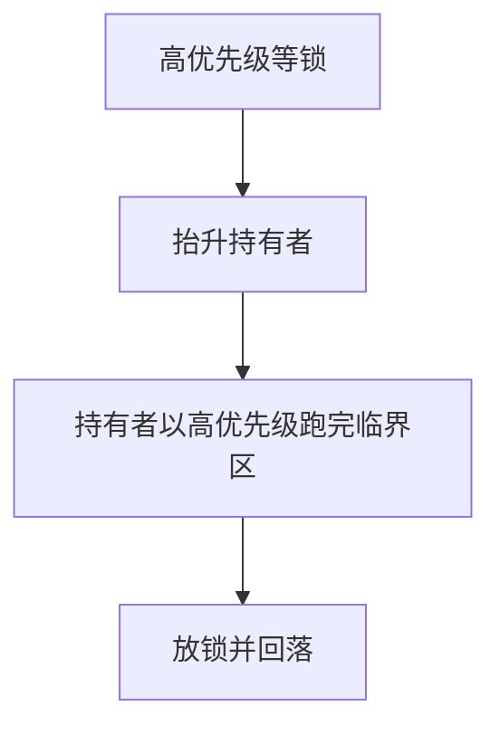

# 优先级继承与天花板

持锁者临时继承等待者中的最高优先级，或锁事先抬到可能碰它的任务的天花板，于是中优先级不能插在临界区中间。

<footer>—— 据 Sha, Rajkumar and Lehoczky, Priority Inheritance Protocols, IEEE TC 1990；Liu and Layland 实时环境整理</footer>

[上一课](/cs/priority-inversion)给出无界反转。缺口是两条经典协议：**优先级继承（PI）**——持锁者优先级 = max(自身, 等待者)；**优先级天花板（PCP）**——任务拿锁时抬到该锁的静态天花板。本课钉有界等待的直觉，不把所有嵌套锁的证明写完。

## 问题

只靠「别用锁」在内核里做不到。PI： $H$ 等 $L$ 的锁，则 $L$ 以 $H$ 的优先级跑完临界区，$M$ 插不进去；放锁后 $L$ 回落。链式等待会把优先级沿等待链传播。PCP：每把锁有天花板 = 可能锁定它的任务的最高优先级；持锁即升到天花板，于是能碰这把锁的人之间互斥更粗、分析更易。缺口不是再画三线程时间线，而是这两条抬升规则。

自阻塞：PCP 下任务可能在锁空闲时仍因天花板规则被挡住，换来死锁避免与更简单的最坏时间。

## 方法

实现 PI：锁上记录持有者与等待队列；阻塞时比较并 boost 持有者，必要时再 boost 它正在等的人。调度器看见的是 boost 后的优先级。PCP：静态分析或声明每锁天花板；获取时升、释放时降到仍持有的锁的最大天花板。本课不绑定 Linux `rt_mutex` 的字段名。

与[MLFQ](/cs/mlfq) 的档位：boost 必须立刻生效，不能等反馈降档周期。

## 机制

PI 让锁上的依赖变成调度器暂时承认的优先级，反转等待被收成临界区长度（再加链上其他人的临界区）。它不消灭死锁：循环等锁仍循环。PCP 的天花板若设对，某些死锁配置进不去，那是副作用，不是银行家。实时课的 WCET 要把 boost 进来的干扰算进去。

## 边界

本课不把 POSIX `PTHREAD_PRIO_INHERIT` 的全部失败模式写完，不讨论如何在用户 futex 上做 PI（后课 futex 会点名）。公平分时默认不用 PI；它是优先级调度的配件。

后课默认：有优先级就应想到 PI/PCP。通用分时若改用权重摊时间而不是固定档，下一课从[时间片与公平调度](/cs/timeslice-cfs)已经给出的直觉往下拆 vruntime。

## 小结

- PI：持锁者继承等待者优先级；PCP：按锁的天花板抬升。
- 反转等待可有界；死锁不因此消失。
- 权重公平与虚拟时间是 CFS 课序的下一缺口。
- 出处：Sha, Rajkumar, Lehoczky, *IEEE TC* 1990；Silberschatz et al., *OSC*。
