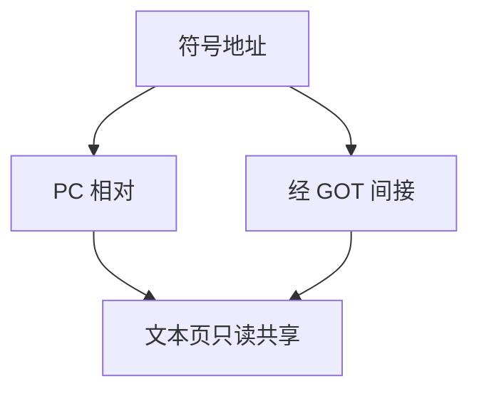

# 位置无关代码

指令不假设自己被装在固定虚址；对全局的访问改成 PC 相对或经 GOT 间接，同一份文本才能被映射到不同进程的不同基址。

<footer>—— 据 System V ABI 与 ELF 规范；Levine, Linkers and Loaders, 2000 整理</footer>

上一课[ABI 与代码生成](/cs/abi-codegen)按合同发出序言、参数寄存器与 `jal`。许多立即数仍是「链接时再填的绝对地址」。本课不重写 callee-save。缺口是**位置无关**：共享库与 ASLR 下，代码段要可写时才重定位会失去页共享。编译器改为 PC 相对取址；对外部符号留下经 GOT 的间接。下一课链接器仍填空洞，只是空洞的类型变成相对或 GOT 槽。

## 问题

固定地址代码：`lui`/`addi` 拼出 `foo` 的虚址。加载到别的基址则全部重定位项要改代码页，文本不能在进程间只读共享，ASLR 每次加载都改页。PIC：对函数用相对 `jal`/`b`；对全局数据用「当前 PC 加位移」或「先找 GOT 再 load」。RISC-V 的 `auipc`+`addi`、x86-64 的 RIP-relative 即此。缺口是代码生成契约，不是再讲 ABI 寄存器号。

静态可执行文件仍可走绝对地址，简单且快。共享对象（`-fPIC`）必须 PIC。可执行文件 PIC（PIE）为 ASLR 服务，后课安全课再收；本课钉生成侧。

### PIC 不是「没有重定位」

仍有重定位：相对位移、GOT 槽的运行时填充。改的是**数据页**（GOT），不是每条指令。不要声称 PIC 零链接。

System V ABI 描述 PIC 与 GOT。Levine 把加载与共享库写成教材。龙书第 7 章链接不把 PIC 写深，本课补在 ABI 与链接之间。[ASLR](/cs/aslr-nx) 是安全课消费本课产物。

## 方法

对局部静态：PC 相对。对外部或可被动态覆盖的符号：生成经 GOT 的 load，槽位由汇编留下重定位类型。小 PIC / 大 PIC（是否假设 GOT 近）按目标约定。禁止在 `.text` 里留下需改写的绝对立即数。

与[指令选择](/cs/instruction-select)：`auipc` 序列是选择问题；本课规定何时必须选它们而不是绝对 `lui`。

## 机制

多一份间接：调用外部可能多一次 load。热路径可用复制重定位（copy reloc）把符号搬进可执行文件，那是链接策略，点名。不要把 PIC 与无栈解释器混谈。

线程局部（TLS）另有模型，本课不展开。

## 边界

本课不合并节、不解析 `printf` 到 libc。不写 PLT 桩的第一条 `jmp *GOT`——下一课链接之后、再下一课 GOT/PLT 表。后课默认：共享代码按 PIC 生成。链接把相对空洞与 GOT 槽写进 ELF。

## 小结

- PIC 用 PC 相对或 GOT 间接，文本可共享、可滑基址。
- 仍有重定位，对象从代码页换成 GOT。
- 静态绝对代码仍合法，共享库不行。
- 出处：System V ABI；ELF；Levine, 2000。
