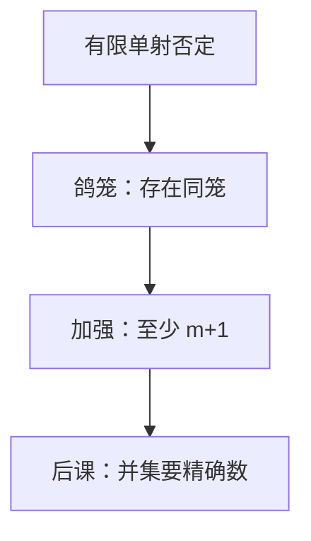

# 鸽笼原理

$n+1$ 只鸽子进 $n$ 个笼子，必有一笼至少两只；证明常常到此为止，不必把那一笼找出来。

<footer>—— 据 Rosen, Discrete Mathematics and Its Applications 整理</footer>

上一课[强归纳与结构归纳](/cs/strong-induction)钉死了如何对每个 $n$ 或每个递归对象证明 $P$。本课不重写基础步，也不从「概率」另起。[函数与可数](/cs/functions-countable)已把有限单射的否定写成一句话。缺口是：后课哈希碰撞、抽屉里的重复，需要可引用的**存在性**格式，以及「至少 $k$ 只」的加强版。归纳证的是全称，鸽笼证的是存在。

## 问题

有限集 $A$ 到更小的有限集 $B$ 没有单射。缺口因此不是新的归纳格式，而是把这句话当引理用：把对象当鸽子、取值当笼子，得出两个对象同值。加强版：$\lvert A\rvert\gt m\lvert B\rvert$ 则某笼子至少 $m+1$ 只。

本课不数「有多少种放法」——排列组合在图与树之后才系统上。[容斥](/cs/inclusion-exclusion)给并集的精确计数，鸽笼只管「至少一个非空过载」。生日问题的概率形式要等离散概率；这里只谈必然重复。

### 鸽笼不是算法

结论是存在，通常不给出构造。把「必有碰撞」当成已经找到碰撞，后课哈希表的最坏链长会说成已经算出来。也不把无限鸽笼（无穷鸽子有限笼）写进主干：本栏输入默认有限。

Rosen 把鸽笼放在计数之前或之中，强调存在性。可数课的有限单射是否定表述；本课把它变成证题格式，并加上加强版。

## 方法

声明 $B$ 是笼子、$A$ 是鸽子，验证 $\lvert A\rvert\gt \lvert B\rvert$。加强版用反证：若每笼 $\le m$，则 $\lvert A\rvert\le m\lvert B\rvert$。典型： $n+1$ 个整数中有两个模 $n$ 同余——笼子是余数 $0,\ldots,n-1$。$n^2+1$ 个两两比较的序列里有单调子列，本课不把 Erdős–Szekeres 写完，只表明加强版能走多远。

## 机制

哈希：槽有限、键更多则必有碰撞——这是最坏存在，不是期望链长。后课期望线性性才问「平均几对」。状态机：鸽笼说明足够长的路径必重复某态，从而有环；图的形式下一课之后才有。

## 边界

本课不引入无限公理、Ramsey 的一般着色。也不把抽屉原理写成概率 $1$：有限必然与「高概率」要分开。容斥、渐近是后续课。

后课默认：要证「必有两个一样」，先指认笼子；要精确 $|A\cup B|$，用容斥。

## 小结

- 鸽子多于笼子则必有一笼至少两只；加强版给至少 $m+1$。
- 只保证存在，不保证构造，也不是概率。
- 精确的重叠计数是下一课容斥。
- 出处：Rosen, *Discrete Mathematics and Its Applications*。
