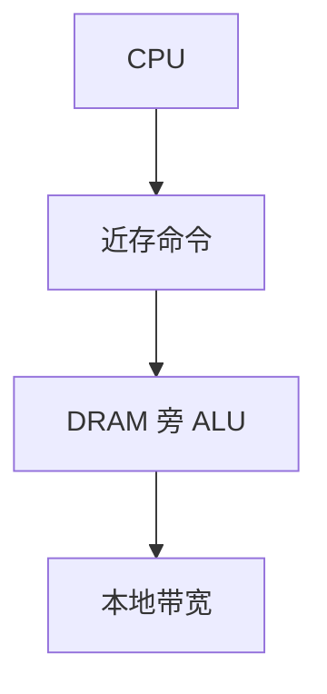

# 近存与存内计算

能耗与延迟的大头往往是把数据搬到很远的 ALU；把简单运算放到 DRAM 接口甚至阵列里，搬动的字节下降，可编程性也下降。

<footer>—— 据 Patterson et al., A Case for Intelligent RAM, IEEE Micro 1997；后续近存架构综述 整理</footer>

[上一课](/cs/dsa-accelerator) 仍通常经过 DMA 把数据拉进加速器 SRAM。[Roofline](/cs/roofline-model) 还没讲，但算术强度低时已经能感觉到带宽墙。本课不重讲作业队列。缺口是 **近存（near-memory）与存内（in-memory）计算：缩短或取消搬移。**

## 问题

cache 层次假设复用；扫描一次的负载复用差，[预取](/cs/stride-stream-prefetch) 只是提前搬，字节仍过片上互连。缺口不是再加一层 LLC，而是**在 HBM/DRAM 栈上放简易 ALU，或在阵列里做按位/按行运算。** IRAM 把处理器与 DRAM 做在一起；当代 PIM 常是逻辑工艺与 DRAM 工艺的叠层妥协。

Patterson 的 IRAM：向量/处理器靠近 DRAM，利用内带宽。真「存内」在存储单元上做模拟或数字运算，噪声与 ISA 都难，近存更常见。

## 方法

近存：在内存控制器或 base die 上放 SIMD/规约单元，CPU 下发「对这片地址做规约」。存内：在 bank 内广播行、做按位与或，再读出。一致性：这些运算如何与 [MESI](/cs/mesi-protocol) 共存是未决设计，常绕过 cache 或先冲刷。

## 机制

省的是互连与 cache 填入，不是算法复杂度。不规则 gather 仍痛。与 GPU HBM：GPU 已经较近，PIM 更近一步、更笨。不要写成量化交易的内存；不要写成大模型权重驻留方案的产品页。

编程模型通常是「对这段连续物理内存做 map/reduce」，而不是任意 load/store ISA。OS 要把页钉住并冲刷 cache，否则近存 ALU 看见的是陈旧行。这与 [写合并](/cs/write-combining) 的 drain 同一类正确性点，只是发生在内存控制器。

## 边界

本课不承诺某工艺可量产的存内精度。异构 SoC 下一课把 CPU 大核、小核、GPU、DSA、内存侧设备放在同一芯片上的调度问题提出来。

后课默认：搬移主导时考虑近存。同一硅上多种流水线的编排是 big.LITTLE 与异构 SoC。

## 小结

- 近存减少搬移；真存内更激进、更难与 ISA/一致性共存。
- 低复用扫描最受益。
- 大小核与加速器共存是下一课异构 SoC。
- 出处：Patterson et al., *IEEE Micro*, 1997。
