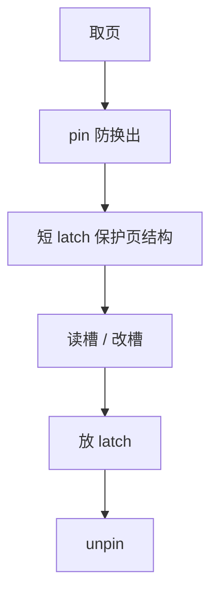

# pin 与 latch

pin 计数禁止缓冲池换出正在读的页；latch 是页上的短互斥，保护槽与页头，不是事务锁。

<footer>—— 据 Gray and Reuter；Mohan 对 latch；Ramakrishnan and Gehrke 对缓冲与并发</footer>

[上一课](/cs/buffer-pool-lru-k)选出牺牲帧。本课不重写 LRU-K。缺口是并发与寿命：工人 A 正解码页上的槽，替换线程不能把帧交给另一表。pin（钉住）解决寿命；latch（闩锁）解决页内结构的互斥。二者都不是 2PL 的行锁。

## 问题

事务锁持有时间跨用户交互，粒度为行或表。页结构（槽数组、空闲空间、LSN）必须在微秒级互斥下改。若用事务锁锁页，粒度太粗、持有太长。latch：读闩/写闩，协议是短临界区，不允许在持 latch 时做 I/O 等待（通常）。pin：`pin_count++` 直到 unpin，替换跳过 pin>0 的帧。

缺口是**两层并发**：事务隔离一层，页物理完整性一层。混用会把死锁检测搞乱——latch 死锁通常靠固定顺序避免，不走 wait-for 图。

Gray and Reuter 区分 lock 与 latch。ARIES 论文里 latch 保护缓冲页。本课不讲 B+ 上的 crabbing，下一课。

## 方法

读页：pin → 取读 latch → 复制或使用指针 → 放 latch → 稍后 unpin（或在使用期间保持 pin）。改页：写 latch 下改，写 WAL，更新 pageLSN，放 latch。顺序错误会撕裂槽或让替换偷走帧。

条件变量：需要等页从磁盘来时，在未持写 latch 的路径上等待 I/O 完成。持 latch 等 I/O 是经典死锁与延迟源。

## 机制

WAL：必须先日志后改页，且常在写 latch 下，避免半改页被读者看见。steal：未提交脏页可换出，但须已记日志；pin 不阻止已 unpin 的脏页成为牺牲者。

监控：pin 泄漏（忘记 unpin）会让池中帧永远钉死，表现为池缩小。这是实现 bug，不是策略。

## 边界

本课不讲 B+ 遍历时的 latch 耦合（crabbing）。也不把 pthread mutex 当事务锁教。意向锁是事务粒度，后课。

后课默认：碰页先 pin，改结构持 latch，事务语义用 lock/MVCC。latch crabbing：遍历索引时如何避免同时钉整条根到叶。

Latch 不是隔离级别。它只让页在物理上可读可写而不撕裂。

## 小结

- pin 管帧寿命；latch 管页内短互斥；lock 管事务。
- 持 latch 不做 I/O；unpin 泄漏会饿死缓冲池。
- latch crabbing 下一课：索引遍历的闩锁耦合。
- 出处：Gray and Reuter；Mohan ARIES；Ramakrishnan and Gehrke。
