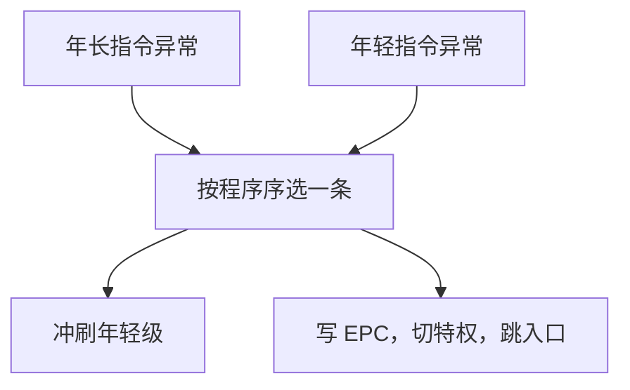

# 流水线异常

流水线里同时活着好几条指令时，异常仍必须看起来像发生在某条指令的边界上。

<footer>—— 据 Patterson and Hennessy, Computer Organization and Design (RISC-V)；Hennessy and Patterson, CA:AQA 整理</footer>

[上一课](/cs/tournament-predict)让 IF 按预测取指，错了就冲刷。[异常与中断入口](/cs/exception-interrupt-entry)和[特权级](/cs/privilege-rings)已经规定：陷入时保存 PC、切到更高特权、跳到入口。本课不重讲入口约定。缺口是：五级里 IF 可能缺页、EX 可能溢出、MEM 可能缺页，几件事可以挤在同一拍。本课只要求**精确异常**：提交点之前的指令全部完成，之后的当作没发生。

## 问题

单周期里异常与当前指令同一拍，PC 就是那条指令。流水线里，MEM 的 load 缺页时，后面的 IF/ID 已经取了不该留下的指令，前面的 add 可能刚要写回。若让 IF 的对齐错优先于更早指令的缺页，软件看见的 EPC 会跳。缺口不是新的陷阱类型，而是**按程序序仲裁，并在提交前冲刷年轻指令**。

中断是异步的，通常挂到某条指令的提交边界，而不是卡在组合逻辑中间。本课把中断与同步异常放在同一套提交纪律下。

不精确异常曾出现在早期流水线浮点核：EPC 不能指出哪一条。操作系统和调试几乎无法接受。教学整数核必须精确。

## 方法

指定 WB 前或 MEM 结束为提交点：只有到达该点的指令可以改架构状态（寄存器堆、已提交的存储）。更年轻的级一律冲刷。同一拍多处异常，选最年长的那条指令对应的原因，把 EPC 写成它的 PC。

load 缺页时，该 load 本身未提交，重试时从它再取。这与误预测冲刷相同：流水线寄存器作废；不同的是接下来进入陷阱处理，而不是用户目标地址。

## 机制

精确性把「流水线内部的重叠」对软件藏起来。处理程序看见的寄存器堆，等于异常指令之前所有指令都已顺序执行完毕。转发与预测仍然存在，但它们改的是未提交状态；提交点一到，旁路值必须已经写入或被丢弃。

外部中断可以等当前指令提交再进陷阱，避免在 ALU 中间切开。缺页、非法指令不能推迟到后面的指令提交之后，否则软件会看见不该存在的写回。

## 边界

本课不引入重排序缓冲：五级顺序流水线用固定提交点就够。[乱序与 ROB](/cs/ooo-rob) 才在乱序执行时用 ROB 重建精确状态。也不把缺页的页表处理写成操作系统课：入口仍是特权级那一套，只是流水线保证 EPC 可信。

后课默认：谈到异常，五级核是精确的；CPI 损失包含冲刷与陷阱路径，定量在下一课。

## 小结

- 多条指令在飞时，异常仍按程序序只报告一条。
- 提交点之前完成，之后冲刷；EPC 指向该指令。
- 乱序下的精确性靠后课 ROB。
- 出处：Patterson and Hennessy, *COD* RISC-V；Hennessy and Patterson, *CA:AQA* 异常与流水线。
