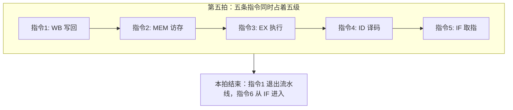

# 流水线五级

把一条指令切成可重叠的几段，时钟只需覆盖最慢的一段，吞吐才不再被整条组合路径绑架。

<footer>—— 据 Patterson and Hennessy, Computer Organization and Design (RISC-V) 整理</footer>

[上一课](/cs/isa-abi-boundary)把 ISA 钉成硬件合同、ABI 钉成软件互调合同：同一 ISA 可带多份 ABI，扩展集写进目标三元组。[单周期数据通路](/cs/single-cycle-datapath)已经能在一个时钟里跑完一条 RISC-V 整数指令，[多周期与微程序直觉](/cs/multicycle-microcode)已经承认可以把取指、译码、执行拆开。本课不重画 ALU，也不从「处理器是什么」另起。缺口是：单周期的时钟被最长路径钉死；多周期解放了周期，却把功能单元闲置。本课只把通路切成五级并重叠。

## 问题

单周期里，取指令存储器、寄存器堆、ALU、数据存储器必须在同一拍内稳定。时钟周期等于这条最长组合路径，简单的 `addi` 也得等 load 走完。用数字感受一下：教科书里常给的量级是——取指约 200 皮秒、读寄存器堆 100 皮秒、ALU 200 皮秒、访存再 200 皮秒，串成一条路径后单周期时钟至少要约 700 皮秒一拍。切成五级后，最慢的一级也只有两百皮秒左右，同一套电路的时钟频率就能提高数倍。快的不算加法本身，快的是「一拍能启动多少条」。多周期让不同指令占用不同拍，平均 CPI 大于 1，吞吐上不去。缺口不是新的 ISA，而是**同时让多条指令分别占用通路的不同段**。

RISC-V 整数指令可以切成取指、译码/读寄存器、执行/有效地址、访存、写回。本课只钉这五级；冒险、转发、分支预测都是后课留下的缺口。

经典五级是 COD 教学机的骨架，不是当代乱序核的流水线深度。后课超标量会加宽，本课先把重叠说清。

## 方法

在相邻级之间插入流水线寄存器，锁存本级要交给下级的 PC、指令字、操作数、ALU 结果和控制信号。理想情况下每个时钟推进一级：第五拍起，每拍提交一条指令，吞吐接近每拍一条，而单条指令的延迟仍是五拍。可以类比洗衣服：洗衣机、烘干机、折叠台就是三个「级」。第一批洗完后，第二批进洗衣机的同时第一批进烘干机——设备不再闲置。从投入第一缸衣服到全部叠好，一批的时间没变短，但稳态下每 40 分钟就有一批完成。流水线加速的是「单位时间完成多少」，不是「单件多快」。

控制仍来自[控制器真值表](/cs/control-truth-table)，只是信号随指令在寄存器里向后传，而不是在一拍里驱动整条通路。本课假定指令存储器与数据存储器暂时可同时访问；做不到时就是后面[结构冒险](/cs/structural-hazard)一课的缺口。

## 机制

重叠改变的是利用率，不是指令语义。程序员仍看见顺序 ISA：[寄存器堆](/cs/register-file)的写回发生在 WB，读发生在 ID。理想 CPI 从单周期的 1 变成「渐近 1」，时钟频率却可以按级内延迟提高。加速来自吞吐，不来自把加法算得更快。常见误区：以为流水线让每条指令算得更快了。实际单条指令从取指到写回的总延迟不降反略升——级间寄存器的锁存要花时间；变快的是「每秒完成多少条」。另一个易错点：流水线满载时五条指令同时在通路里，一条出了错，后面四条都还不能提交，「谁的异常」由此成为后课的难题。

五级是对 RISC-V 整数核的划分：load/store 需要 MEM，算术指令在 EX 已出结果，分支的目标与条件也在 EX 才齐。划分本身会制造后课要处理的相关：后指令在 ID 读寄存器时，前指令可能还没写回。

## 边界

本课不引入停顿、转发或分支预测，也不处理浮点或多周期运算。异常在[异常与中断入口](/cs/exception-interrupt-entry)已有入口约定，流水线里同时有多条指令时「哪一条的 PC 算异常」是[流水线异常](/cs/pipeline-exception)的缺口。特权级规则不变：流水线不额外授权。

后课默认：谈到经典流水线，指 IF/ID/EX/MEM/WB 与级间寄存器。理想吞吐每拍一条，尚未计入冒险。

## 小结

- 单周期被最长路径卡住；五级重叠把时钟收到最慢的一段。
- 理想情况下第五拍起每拍完成一条，CPI 渐近为 1。
- 冒险、转发、异常精确性都是后课的缺口。
- 出处：Patterson and Hennessy, *Computer Organization and Design* RISC-V 版流水线章。
