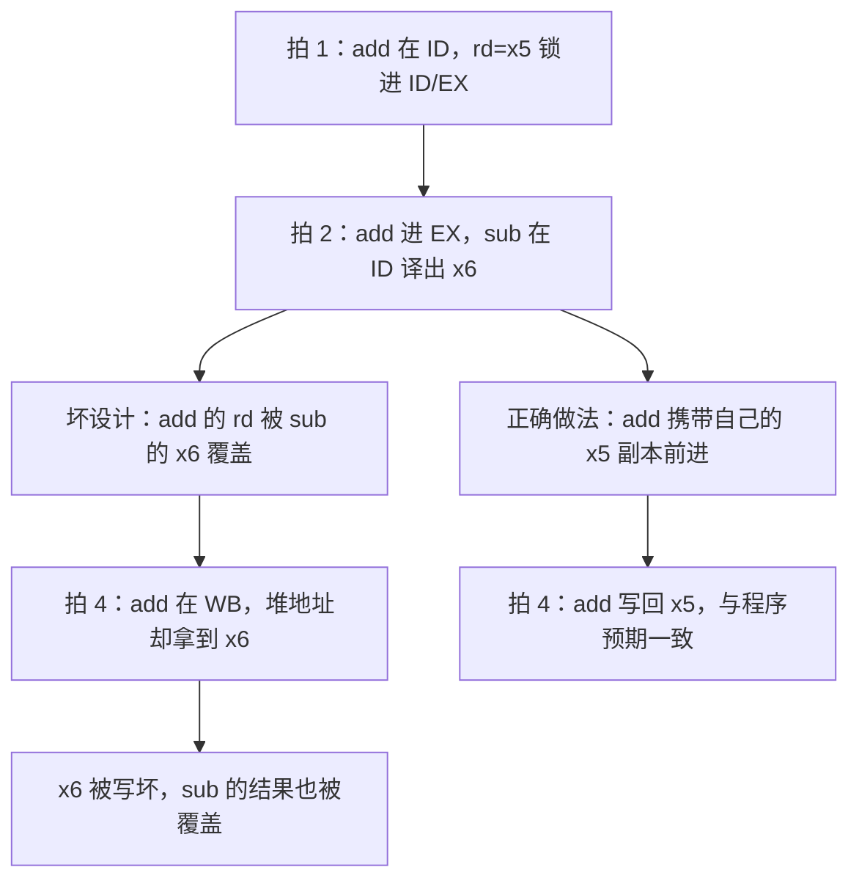

# 流水线寄存器

相邻两级之间必须有锁存：本拍算完的 PC、指令字和控制位，下一拍才能被下一级当成稳定输入。

<footer>—— 据 Patterson and Hennessy, Computer Organization and Design (RISC-V)；Hennessy and Patterson, CA:AQA 整理</footer>

[上一课](/cs/pipeline-five-stage)把通路切成 IF/ID/EX/MEM/WB，并已经点名「级间要插寄存器」。本课不重画五级，也不从组合数据通路另起。缺口是：重叠若没有隔离，后一级的组合逻辑会直接搅进前一级尚未稳定的网。本课只钉流水线寄存器里该锁什么，以及控制信号如何随指令向后走。

## 问题

五级在纸上是五段组合云。同一拍里 IF 正在取下一条，EX 正在用上一条的操作数；若 ALU 输入直接连寄存器堆读口，堆的地址已经换成新指令的 `rs`，旧指令的运算被破坏。缺口不是再加一级，而是**每级边界上的锁存：只让本级在时钟沿把产出交给下级，级内组合在一拍内算完**。

控制同样要走寄存器。上一课假定真值表在一拍里驱动整条通路；重叠之后，MEM 的 `MemWrite` 必须属于正在访存的那条指令，而不能属于刚在 ID 译出的那条。

教学机常画 IF/ID、ID/EX、EX/MEM、MEM/WB 四组。WB 写堆发生在时钟沿，通常不再需要第五组「WB 之后」。

可以把它想象成流水线上的托盘：每道工序做完，把半成品连同工单（控制位、`rd`）一起放上托盘，传给下一道工序。没有托盘，两道工序就共用同一张工作台，后一道会在前一道还没完工时乱动对方的东西。

常见误区：以为控制信号在译码后「广播」给全流水线共用。实际上每个控制位都要复制一份随指令走——MEM 段用的 `MemWrite` 是访存那条指令自己携带的那份，不是 ID 刚译出的下一条的。

## 方法

IF/ID 锁 PC+4 与指令字。ID/EX 锁两个操作数、立即数、目的寄存器号，以及 EX/MEM/WB 要用的控制位。EX/MEM 锁 ALU 结果、要写的数据、分支条件。MEM/WB 锁从存储器或 ALU 来的写回值与目的号。

停顿与冲刷后课才引入：本课假定每拍四组都装新值。气泡在后课里就是把某组控制位置成「不写、不访存」的 NOP。

## 机制

锁存把「同时在飞的几条指令」变成几份互不干扰的快照。程序员仍看见顺序 ISA：写回值来自 MEM/WB，与 IF 正在取的那条无关。时钟周期覆盖最慢一级的组合延迟**加上**寄存器建立时间；上一课说的「时钟收到最慢一段」在本课才有对象。

数字实例：设最慢一级组合延迟 200 ps、寄存器建立时间 50 ps，则时钟周期必须不短于 250 ps。少算建立时间这一份，时钟沿到来时锁存器可能锁进还没稳定的值，流水线随机出错且极难复现。

目的寄存器号必须随指令走完 WB。否则写回时堆地址会用错成更年轻指令的 `rd`。这不是数据冒险——值可以是对的——而是控制与标识没有随流水线前进。

「`rd` 必须随身携带」如果违反，会坏在哪一步？

这条坏路径最阴险的地方：ALU 算出的值是对的，指令顺序也对，唯独写错了格子。调试时程序逻辑看起来没问题，某个寄存器却莫名变了——根源只是 4 字节的目的寄存器号没有跟着指令走完四拍。

## 边界

本课不检测相关，不插入气泡，不冲刷。结构上两级抢同一端口，是[结构冒险](/cs/structural-hazard)的缺口。也不把流水线寄存器当成 ISA 可见状态：调试器看见的是提交后的架构寄存器。

后课默认：谈到经典五级，级间有四组锁存，控制位随指令前进。理想情况下每拍各组前进一格。

## 小结

- 重叠靠级间锁存隔离组合网；没有它们，后级会改写前级的输入。
- 操作数、PC、`rd` 和控制位都要随指令走完该走的级。
- 结构冲突与 RAW 转发都是后课的缺口。
- 出处：Patterson and Hennessy, *COD* RISC-V 流水线数据通路；Hennessy and Patterson, *CA:AQA*。
