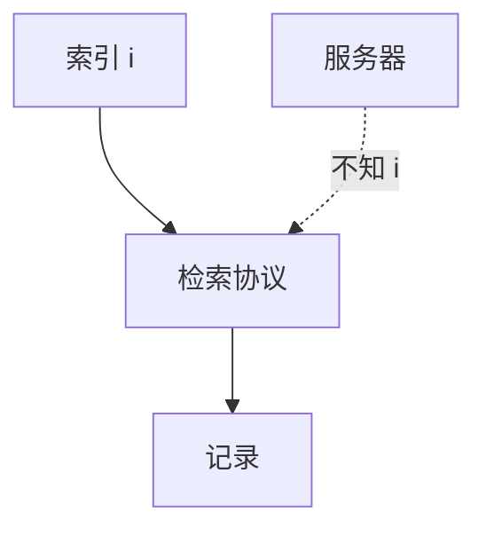

# PIR

私有信息检索让用户从服务器取第 i 条，而不让服务器知道 i。信息论 PIR 要多服务器；计算 PIR 用同态，更重。索引隐私与内容保密不是同一句话。

<footer>—— Chor, Goldreich, Kushilevitz and Sudan, Private Information Retrieval, JACM 1998</footer>

## 定位

上一课[MPC](/cs/mpc-applications)是多方表。缺口是**单用户对数据库的查询隐私**。本课 PIR 直觉。

后课默认已经读完本课钉下的合同，只补差，不从该领域第一性原理重开。

## 问题

HTTPS 仍让服务器看见 URL 或索引。PIR：服务器不知 i。缺口是通信膨胀与恶意服务器。

### 不是匿名网

PIR 不藏网络身份；Tor 后课管路由。

CGKS 1998。Tor 下一课。

## 方法

对照下载全集（平凡 PIR）。多服务器异或构造点名。下一课 Tor。

图中节点是本课的机制骨架；课程不把图展开成可运行的攻击步骤。

## 机制

查询隐私。Tor 把 IP 与目的藏进接力。

前提写进合同之后，游戏外的误用只当失败模式点名，不在本课写成操作程序。

## 边界

不写实现作业当攻击。Tor 洋葱路由下一课。

## 小结

- MPC 多方；PIR 用户对库的索引隐私。
- 平凡解是下载全部；协议换通信量。
- 不替代匿名网络。
- 下一课 Tor。
- 出处：Chor, Goldreich, Kushilevitz and Sudan, 1998。
