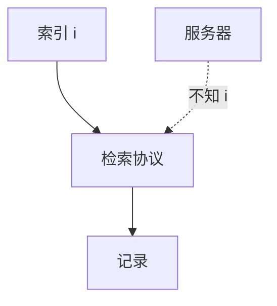
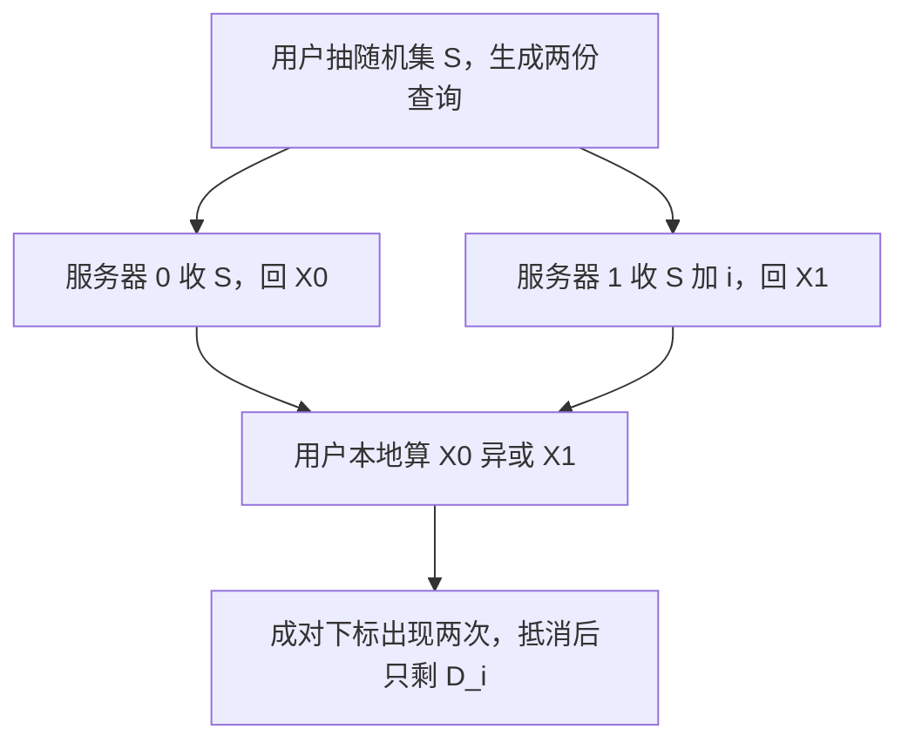

# PIR

私有信息检索让用户从服务器取第 i 条，而不让服务器知道 i。信息论 PIR 要多服务器；计算 PIR 用同态，更重。索引隐私与内容保密不是同一句话。

<footer>—— Chor, Goldreich, Kushilevitz and Sudan, Private Information Retrieval, JACM 1998</footer>

上一课[MPC](/cs/mpc-applications)是多方表。缺口是**单用户对数据库的查询隐私**。本课 PIR 直觉。

后课默认已经读完本课钉下的合同，只补差，不从该领域第一性原理重开。

## 问题

HTTPS 加密传输，却仍让服务器看见 URL 或索引——被保密的是内容，不是「你查了哪一条」。PIR 的合同是服务器答对第 $i$ 条却推不出 $i$。缺口随之有两个：私有查询要付多少通信膨胀，以及恶意服务器返回假答案时用户能否察觉。

### 不是匿名网

PIR 不藏网络身份；Tor 后课管路由。

CGKS 1998。Tor 下一课。

「内容保密、查询不保密」的直观版：加密快递盒没人看得见里面是什么，但快递单上明晃晃写着你去取的是哪个柜子、几点取的。PIR 要办的事就是把「取的哪一格」这一行也从单子上抹掉。

## 方法

平凡解是下载全集：隐私完美，通信 $O(n)$，大库上不可行。方法因此是拿协议换通信：多服务器方向把独热向量拆成随机份额，让每台单独看都一无所知。下一课 Tor。

```mermaid
flowchart TD
  I["索引 i"] --> PIR["检索协议"]
  PIR --> REC["记录"]
  SRV["服务器"] -.->|"不知 i"| PIR
```

## 机制

两台服务器就能把「取第 $i$ 条」拆成不可识别的查询份额。设数据库是 $n$ 个比特 $D_0,\dots,D_{n-1}$，两台服务器各存同一份。用户先抽均匀随机集合 $S\subseteq[n]$，把独热指示向量 $e_i$ 用一次性掩码拆成两个查询份额：服务器 0 收到 $S$，服务器 1 收到 $S\oplus\{i\}$。两台各自返回所收集合内全部条目的异或和：

$$X_0=\bigoplus_{j\in S}D_j,\qquad X_1=\bigoplus_{j\in S\oplus\{i\}}D_j.$$

用户本地计算 $X_0\oplus X_1$：两个集合的对称差恰为 $\{i\}$，其余下标在两个和里成对出现、异或抵消，只剩 $D_i$。查询隐私在信息论意义成立：每台服务器看到的查询都是均匀随机集合，与 $i$ 统计独立——单看任一份都不泄露。通信量是两份长 $n$ 的指示向量加两比特答案，即 $O(n)$；这与平凡下载全集同阶，正是 CGKS 之后研究的起点：多服务器方向用 $k$ 台服务器把通信压到约 $n^{1/k}$ 的亚线性，代价是复制数据库；单服务器计算性 PIR 改用同态加密：在加密查询上算出加密条目，只复制一份，但安全性退到计算性假设。Tor 管网络路径匿名，PIR 藏数据库下标，两者不互相替代。

单服务器计算性 PIR 由 Kushilevitz and Ostrovsky, FOCS 1997 开创（二次剩余假设）；全同态加密成熟后，PIR 成为 FHE 的直接应用，通信可压到多对数级，代价是数量级的计算与密文膨胀。

这两份查询份额到底怎么把 $D_i$ 「挤」出来？

```mermaid
flowchart TD
  U["用户抽随机集 S，生成两份查询"] --> S0["服务器 0 收 S，回 X0"]
  U --> S1["服务器 1 收 S 加 i，回 X1"]
  S0 --> X["用户本地算 X0 异或 X1"]
  S1 --> X
  X --> R["成对下标出现两次，抵消后只剩 D_i"]
```

数字实例：$n=8$、$i=5$ 时取 $S=\{1,4,6\}$，则服务器 1 收到 $\{1,4,5,6\}$。$X_0=D_1\oplus D_4\oplus D_6$，$X_1=D_1\oplus D_4\oplus D_5\oplus D_6$；两者异或时 $D_1,D_4,D_6$ 各出现两次自动抵消，只剩 $D_5$。

常见误区：以为一台服务器也能做到「信息论」保密。CGKS 已证明：单服务器、信息论安全、通信量严格小于下载全集，三者不可兼得。所以单服务器方案必然退到计算性假设——服务器算力够强就能破，多服务器方案则连无限算力也破不了。

## 边界

不把实现细节写成利用作业；时间侧信道、恶意服务器返假答案、查询模式关联都在信息论保证之外。Tor 洋葱路由下一课。

## 小结

- MPC 多方；PIR 用户对库的索引隐私。
- 平凡解是下载全部；协议换通信量。
- 不替代匿名网络。
- 下一课 Tor。
- 出处：Chor, Goldreich, Kushilevitz and Sudan, 1998。
