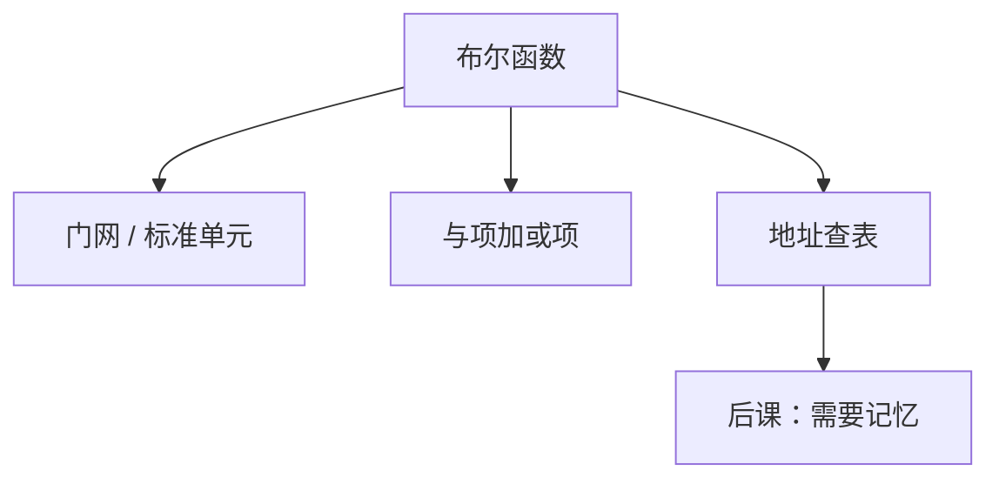

# PLA 与 ROM 作组合

任意真值表不必化成最少门：ROM 按地址读出函数值，PLA 烧与项再或起来，都是组合，只是实现形态不同。

<footer>—— 据 Harris and Harris, Digital Design and Computer Architecture 整理</footer>

上一课[比较器](/cs/comparator-circuit)把 eq / 有符号 / 无符号三种比较收成组合块。从[反相器](/cs/cmos-inverter)到比较，主干一直在拼门。本课不重接线旗标，也不从 FPGA LUT 架构史另起。缺口是：有些函数（控制器、不规则译码）用两级**可编程与-或**或一张表更自然。

## 问题

规范 SOP 是与项的或。PLA：可编程与阵列生成乘积项，或阵列把项送到各输出。ROM：地址即输入，每个地址存输出字，功能是「完整真值表」。缺口不是新的布尔公理，而是承认组合逻辑有**表驱动**实现，后课微程序、控制 ROM 用同一直觉。

PLA 不必列出全部 $2^n$ 最小项，只烧需要的积项。ROM 在输入变宽时指数爆炸，只适合输入少、输出不规则。

### ROM 不是存储器课的「可写主存」

这里的 ROM 是组合查表：地址变，数据在 $t_{pd}$ 后稳，没有写口、没有刷新。后课[SRAM/DRAM 阵列](/cs/memory-array-sram-dram)才是可写存储。把本课 ROM 当成 DRAM，时序单元会提前出场。

Harris 用 PLA 实现有限状态机的下一态与输出——那是时序课；本课先当纯组合。PROM/EEPROM 的浮栅是工艺，功能仍是表。

## 方法

输入经缓冲与反相，进与平面；积项进或平面得输出。ROM：译码器点一行，位线给出预存比特。两者都有明确 $t_{pd}$，计入[关键路径](/cs/critical-path)。

## 机制

比较器、ALU 用结构块更省。不规则控制（「这些 opcode 组合才置这一位」）用 ROM/PLA 更直。后课单周期控制器真值表可以落成 PLA 或 ROM，仍是组合 $y=f(\mathrm{opcode})$。组合主干到此收束：功能可门可表；下一课开始状态。

## 边界

本课不讲 FPGA 的 LUT 与可重配置互连，那是另一封装。不把闪存文件系统当 ROM 组合。时序电路仍未出现。

后课默认：任意组合函数可用门网、PLA 或 ROM 实现；下一课锁存与触发器才有记忆。

## 小结

- PLA 烧 SOP；ROM 存真值表；都是组合。
- 输入宽时 ROM 不划算；规则运算仍用加法器等结构块。
- 可写存储器是后课阵列，不是本课的 ROM。
- 出处：Harris and Harris。
