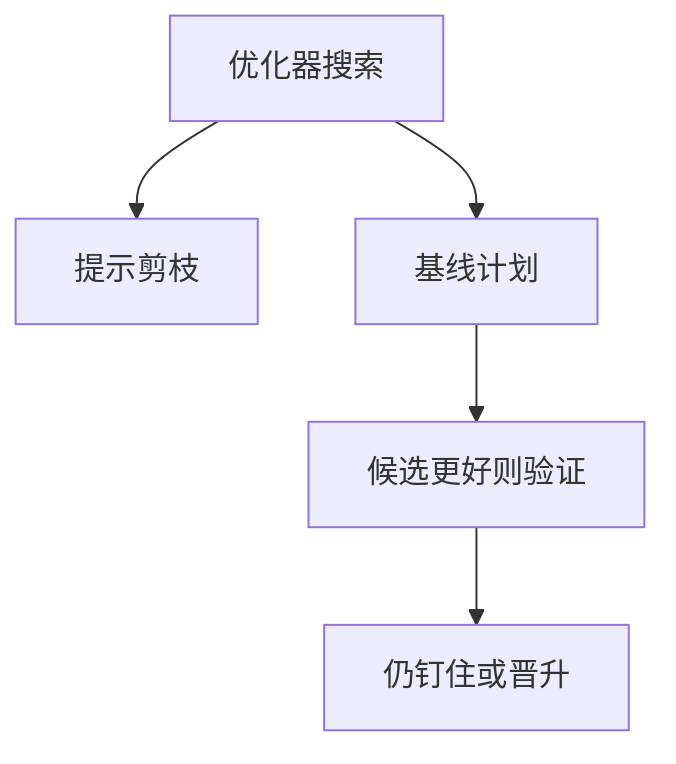

# 计划提示与稳定性

提示把搜索剪成一条指定路径；稳定性要求同一语句在统计微扰下不要突然换树。两者都是对优化器自主性的约束，不是代数律。

<footer>—— 据 Weikum 等对计划稳定性；产品优化器 hint 文档；Selinger 搜索对照</footer>

[上一课](/cs/mv-refresh)把物化当可匹配的副本。本课不写 delta 规则。缺口是运维：学习估计、缓存、自动 ANALYZE 会让计划在版本之间跳动。提示（hint）强制访问路径或连接顺序；稳定性（plan stability / baselines）把验收过的计划钉住。优化器单元接近收口，回归下一课专门命名「变慢」。

## 问题

DP 每次可合法地选出不同树：统计刷新、参数窥视、软件版本。报表昨日 2 秒、今日 200 秒，指称仍对。缺口是**控制权**：hint 嵌入 SQL 或大纲（outline）存服务器。过强的 hint 在索引删除后变成错误或静默忽略——合同必须写清。

稳定性不是最优：钉住的计划在数据长大后可能变差。它换的是可预测。与自适应相反：自适应要变，稳定性不要变。工作负载要分类：OLTP 短查询常要稳定；一次性分析可全搜索。

Oracle SQL Plan Baseline、SQL Server 计划指南一类是产品名。本课要的机制：存储一套可接受计划，优化器只在代价显著更好且通过验证时才换。

## 方法

hint：指定索引名、连接算法、顺序、禁止某种改写。范围尽量小，避免整句写死。baseline：第一次好计划入库；演化时候选计划在影子执行或代价阈值下晋升。失败回退上次。

与预编译：通用计划本身就是一种稳定性（不看参数）。倾斜时要允许特殊计划例外列表，而不是全局关缓存。

## 机制

合法性：hint 不能打破外连接方向、不能跳过必做谓词。代价模型仍运行，只是可行集变小。日志：记录为何没用 hint（索引名改了），否则静默全扫。

提示与 ORM：生成 SQL 带 hint 使迁移脆弱。更好的是服务器侧 baseline 按语句指纹匹配。

## 边界

本课不把一次变慢的取证写完——下一课计划回归。也不把 hint 当索引选择的替代：缺索引应建索引，而不是 hint 一个不存在的名字。

后课默认：生产关键语句可钉计划；钉住要有过期审查。回归课用估计/实际与变更事件解释「为何换树」。

稳定性是运维不变式，不是查询指称的一部分。

## 小结

- 提示缩小搜索；基线把验收计划钉住并可受控演化。
- 索引消失后 hint 必须失败可见。
- 计划回归下一课：把「突然变慢」收成诊断对象。
- 出处：计划稳定性实践；Selinger 对照；Ramakrishnan and Gehrke。
