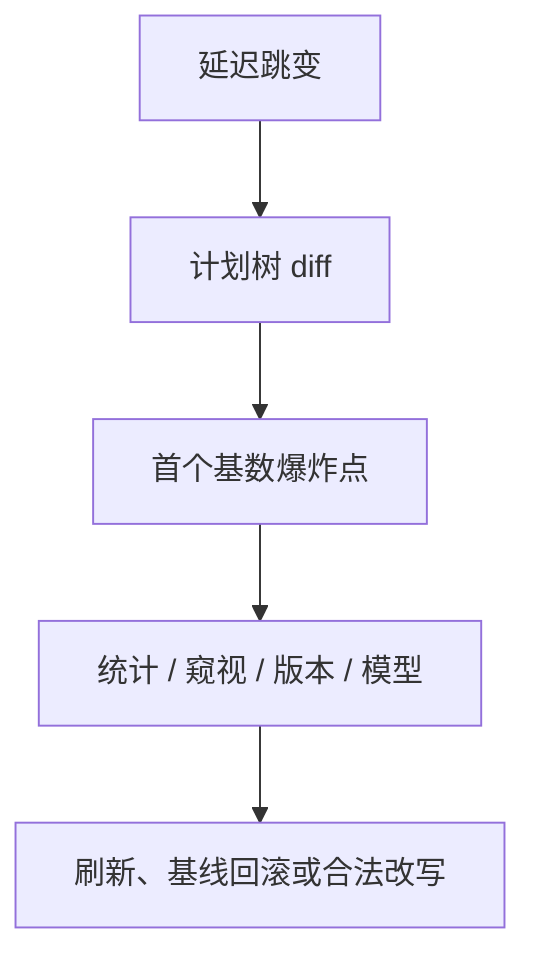

# 计划回归

同一语句、同一指称，物理树一换，延迟可以差两个数量级。回归是优化器与统计的事故，不是业务写错 SQL。

<footer>—— 据优化器回归工程实践；Ioannidis 误差敏感；Gray 对测量</footer>

[上一课](/cs/plan-hints-stability)给出钉计划的手段。本课不罗列 hint 语法。缺口是事故本身：计划回归（plan regression）——软件升级、统计、参数、缓存失效之后选出更差树。优化器单元在此封口；执行引擎单元从 Volcano 迭代器再开。

## 问题

症状：CPU 或 I/O 突然涨，`EXPLAIN` 显示连接顺序或算法变了，估计行数与过去差数量级。原因候选：ANALYZE 后直方图变；数据量过阈值；绑定窥视碰到极端参数；代价常数随版本改；学习模型漂移。缺口是**诊断顺序**，不是再讲 DP。

与查询回归（SQL 写错、缺谓词）分开：那是指称或结果集变。计划回归结果应相同（忽略超时截断）。

捕获前后计划文本、估计与实际行数、当时统计版本，是取证最小集。没有基线计划，回归只能靠人眼。Gray 强调测量；这里测的是优化器输出。

## 方法

对比两份计划树。看第一个估计/实际爆炸的节点。检查该节点上的谓词、NDV、是否新索引、是否禁用了下推。修复：更新统计、删误导列组统计、对倾斜参数用重优化、baseline 回滚、或修 sargable。最后才 hint。

测试：把关键语句的计划形状纳入 CI，升级优化器版本时 diff。这是工程，但是本课缺口的闭合方式。

## 机制

缓存：旧好计划被淘汰，新优化用新统计选出坏树——表现为「重启后变慢」。自适应可能在单次内修好，日志里仍应留下回归事件以便修根因。

执行引擎下一单元会改变算子常数（向量化让扫描更便宜），升级引擎等于重校准；也会表现为计划回归，要与「只换统计」分开。

## 边界

本课不讲 Volcano 拉模型。也不把每一次慢查询都叫回归：数据真的涨了十倍，计划换树可能是正确的。回归指定「不该变差的变差了」。

后课默认：关键语句有计划基线与 diff。执行引擎第一课：物理算子如何真正吐元组。

优化器单元从 Selinger 搜到回归运维，补的是主干「有计划、有代价」之后的搜索、估计与控制。

## 小结

- 计划回归是合法但更差的树；用计划 diff 与基数爆炸点定位。
- 先统计与基线，后 hint。
- 下一单元 Volcano 迭代器：执行模型从「树」落到「next()」。
- 出处：Ioannidis；Gray；计划管理实践。
