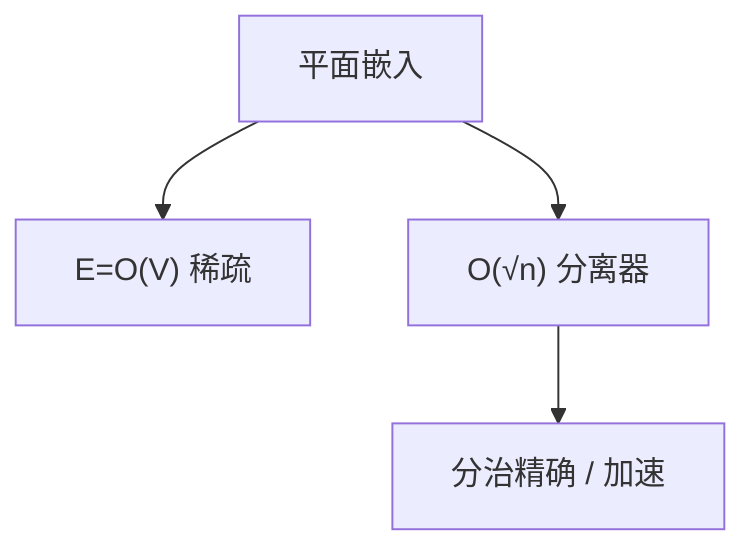

# 平面图算法

平面图 $E=O(V)$，有线性分离器；许多 NPC 问题在平面上仍难，但分离器给了亚指数精确与更快的最短路。

<footer>—— 据 Kuratowski, 1930；Lipton and Tarjan, A Separator Theorem for Planar Graphs, 1979；四色见 Appel and Haken, 1977 整理</footer>

上一课[图着色与启发](/cs/graph-coloring)在一般图。平面图：$K_5$、$K_{3,3}$ 的细分禁止（Kuratowski）。四色 $\chi\le 4$。本课不重证四色。缺口是**算法后果**：欧拉公式导出稀疏；$O(\sqrt n)$ 分离器；最短路、独立集等因此更快或可分治。后课图同构直觉。

## 问题

嵌入平面则 $E\le 3V-6$（$V\ge 3$，简单）。对偶图：面当点，边相交当相邻。平面分离器：可在 $O(n)$ 找到大小 $O(\sqrt n)$ 的点集，删后每块 $\le 2n/3$。分治：子问题规模降，加上跨越分离器的枚举。独立集、哈密顿在平面上仍 NPC，但 $2^{O(\sqrt n)}$ 精确成为可能。

缺口是稀疏与分离，不是画图美学。

### 四色不是线性时间着色课的主定理

四色存在；求 5-着色有线性/近线性算法（线性时间 5-着色经典）。四色的证明是计算机验证个案，本课当黑盒：$\chi\le 4$。6-着色由 degeneracy $\le 5$ 立即得到。

Lipton–Tarjan 1979 分离器。Hopcroft–Tarjan 平面性线性判定。后课同构：平面图同构曾更早有多项式，一般图更晚。

## 方法

平面性：左–右/PQ 树或 Hopcroft–Tarjan，$O(n)$。最短路：稀疏图 Dijkstra $O(n\log n)$；更细的平面最短路（Henzinger 等）点名。分离器递归解 NP 子集问题。

最大流在平面 $s$–$t$ 可用对偶最短路，点名。

## 机制

欧拉 $V-E+F=2$ 加每面至少 3 边推出稀疏。分离器来自平面网格式的等周：最短路树或 BFS 层切。与一般图：扩展图没有小分离器，点分治式的亚指数失败。不要把「画在纸上不交叉」当算法已给嵌入——先判定平面性。

## 边界

本课不写 Robertson–Seymour 浅，不写曲面亏格全文。不进光刻掩模几何。后课默认：平面 $\Rightarrow$ 稀疏 + 分离器；四色当事实。下一课图同构的直觉与算法地位。

## 小结

- 平面稀疏；Kuratowski 禁 $K_5$、$K_{3,3}$。
- Lipton–Tarjan 分离器支撑分治。
- 许多问题仍 NPC，但指数底可变。
- 出处：Kuratowski, 1930；Lipton and Tarjan, 1979；Appel and Haken, 1977。
