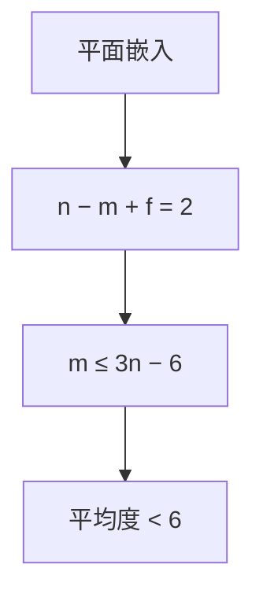

# 平面图直觉

能画在平面上使边只在顶点相交，则边数相对顶点数是线性的；稀疏不是偶然，是欧拉公式在管着。

<footer>—— 据 Euler 多面体公式；Cormen, Leiserson, Rivest and Stein 对平面图 $m=O(n)$ 的用法 整理</footer>

[上一课](/cs/dag-repr)把有向无环钉成可线性扩展的依赖图，数据结构课的表示轴在 DAG 结束。本课不重讲拓扑序，也不从「图是什么」另起。缺口是另一类全局形状：平面性给出 $m\le 3n-6$（简单连通平面，$n\ge 3$）这类线性边数，解释道路网、网格为什么落在稀疏假设里。算法课下一课才用循环不变式；本课只交直觉与这条界，不跑平面性判定。

## 问题

稀疏课写 $m\ll n^2$ 是工作假设。平面图把它变成定理：欧拉 $n-m+f=2$（连通平面嵌入，含外脸），每张脸至少 3 条边、每边贴 2 脸，得 $2m\ge 3f$，消掉 $f$ 即 $m\le 3n-6$。缺口不是新的 CSR 字段，而是**何时可以默认度数的平均值 $\le 6$**，从而「扫所有边」与「扫所有点」同阶。

$K_5$、$K_{3,3}$ 非平面，Kuratowski：含它们的细分则非平面。本课点名，不证。

平面嵌入是画法；同一抽象图可以有的能画、有的不能。数据结构存的仍是邻接，不自动带嵌入。

## 方法

表示仍用 CSR 或邻接表。若输入承诺平面，算法可用 $O(n)$ 边的界写时间；若不承诺，最坏仍 $m=\Theta(n^2)$。对偶：脸当顶点、相邻脸连边——附录，主干只承认脸的计数出现在欧拉式里。

与 DAG：无环不管能不能画平；平面不管有没有向。网格两者都常满足，道路网近似平面（立交是少数例外）。

## 机制

平均度有界让「每个点处理 $\deg(v)$」的算法在平面输入上近线性。最短路、最小生成树的堆操作次数仍跟 $m$ 走，因而也线性档。这不是平面专用算法（那些用 r-division 的附录），只是稀疏参数被几何钉死。

非平面的稀疏图（随机 $d$-正则）同样 $m=O(n)$，但没有欧拉脸计数；不要把稀疏与平面画等号。

## 边界

本课不实现左儿子右兄弟式的嵌入数据结构，不跑 Hopcroft–Tarjan 平面性。也不把四色定理当课。循环不变式课开始后，正确性靠断言，不再靠「图画出来看起来对」。大模型、量化、光刻栏的图不在这里借用。

后课默认：谈到平面输入，可用 $m=O(n)$。数据结构课结束；算法课用不变式给循环证明。

## 小结

- 简单平面图 $m=O(n)$，来自欧拉与脸的度数。
- 表示仍是稀疏邻接；平面是额外几何约束。
- 数据结构课收束；下一课循环不变式。
- 出处：欧拉公式；Cormen et al. 对平面图边数的标准推论；Kuratowski 作为非平面对照。
