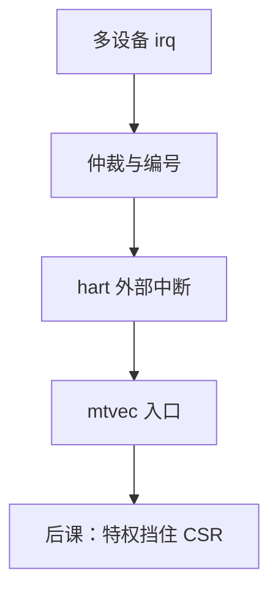

# PLIC 与中断号

外设拉线只表示「有事」；平台级中断控制器把多路请求仲裁成一个待处理中断，并给出编号，CPU 仍走 `mtvec` 那条入口。

<footer>—— 据 Patterson and Hennessy, Computer Organization and Design (RISC-V)；The RISC-V Instruction Set Manual, Volume II: Privileged Architecture 整理</footer>

上一课[异常与中断入口](/cs/exception-interrupt-entry)钉死了保存 PC、写入 `mcause`、跳到 `mtvec`。本课不重列 `mret`，也不从 Linux 底半部另起。缺口是：许多设备如何合成**一个**异步请求，以及软件怎么知道是哪一台——RISC-V 教学里的 PLIC（平台级中断控制器）。

## 问题

入口机制不管源。缺口是中断控制器：各设备 irq 进 PLIC，按优先级与使能仲裁，向 hart 的外部中断引脚断言。软件在入口读 `mcause` 知是外部中断，再 MMIO 读 PLIC claim 寄存器得到中断号，处理完 complete。编号不是 opcode，是设备线的索引。

本课只钉汇聚与编号。谁允许关中断、用户能否碰 PLIC，是[下一课](/cs/privilege-rings)。

### PLIC 不是另一套陷阱硬件

PC 仍进 `mepc`，入口仍是 `mtvec`。PLIC 是[MMIO](/cs/bus-mmio) 上的从设备，外加一根接到 hart 的中断线。把 PLIC 理解成替换 `mtvec` 的第二套向量表（有的实现用 vectored 模式加速），主干仍是同一陷阱路径。

特权手册描述外部中断与控制器。SiFive / RISC-V 平台常用 PLIC；CLINT 管软件中断与定时器，本课点名不展开。Patterson/Hennessy 用「中断优先级」教学，对象同一。

## 方法

设备 → PLIC 网关（边沿/电平）→ 优先级比较 → hart 使能门槛 → `meip`。入口：保存通用寄存器，claim，分支到设备处理，complete，`mret`。嵌套与阈值写在 PLIC 寄存器，本课承认有优先级，不写抢占栈。

## 机制

没有 PLIC（或等价物），多设备只能线或，软件只能轮询所有 MMIO 状态。有了编号，处理程序可跳表。精确异常仍由上一课定义；PLIC 只解决「异步源的身份」。定时器中断常走 CLINT，不经 PLIC，`mcause` 编码不同。

## 边界

本课不讲 MSI/MSIx、不把 IOMMU 请进来。不讨论中断亲和与多 hart 路由细节。NMI 不走 PLIC。

后课默认：外部中断经控制器变成带编号的请求，入口仍用 CSR。下一课用特权级保护 `mtvec` 与 PLIC 寄存器。

## 小结

- PLIC 仲裁多路 irq，claim 给出中断号。
- 陷阱路径仍是 `mtvec`/`mepc`/`mcause`。
- 控制器本身是 MMIO 设备。
- 出处：Patterson and Hennessy, COD (RISC-V)；RISC-V Privileged Spec。
