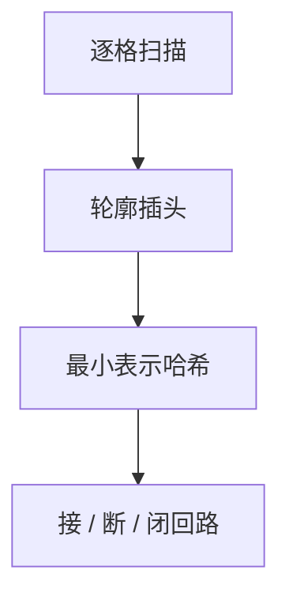

# 插头 DP

网格路径/回路的轮廓线上，插头连通性用括号或最小表示压进哈希；逐格转移，状态在轮廓宽度上指数。

<footer>—— 据网格轮廓线 DP 的标准技法；铺砖与回路计数整理</footer>

上一课[SMAWK](/cs/smawk)加速数值一层 DP。网格上哈密顿回路、连通铺砖，一行掩码只记录占用，不表达「哪些插头已经互连」。缺口是插头 DP：沿轮廓维护插头匹配。不重写状压一行兼容表。后课换根 DP 回到树。

## 问题

$n\times m$ 网格，要一条简单回路过指定格，或若干连通块。扫描到格 $(i,j)$ 时，已处理区域的边界（轮廓）上若干插头。转移：当前格是否把相邻插头接上、断开、或闭合一条回路。连通性用括号序列或并查集；同一连通的不同编号要最小表示，否则状态爆炸。

缺口是轮廓连通，不是 Held–Karp 的点子集。$m$ 小 $n$ 大则沿短边做轮廓，状态随 $m$ 呈 Catalan 级而非单纯 $2^m$。

### 不是普通状压铺砖

无连通约束时，掩码兼容即可。有「必须整块连通/恰好一回路」才上插头。不要无连通也写并查集。

轮廓线思想用于铺砖更早；插头 DP 在竞赛中系统化。后课换根与网格无关。Kirchhoff 矩阵计生成树不在此。

## 方法

按行逐格。哈希表存当前轮廓状态的方案数或最优值。插头：空/左/右配对。合法转移后把轮廓平移一格。最后轮廓应无插头。

宽度 $m$ 决定指数底，先估计状态数再写。

## 机制

逐格后轮廓平移，插头集合更新。平面匹配用括号。最小表示避免同一并查不同编号。与生成函数：可看成自动机，状态多则哈希。与状压：状压是插头 DP 在「无连通记忆」时的退化。

## 边界

本课不写全部插头题型模板。三维网格不写。后课默认：网格连通路径/回路用插头；无连通用状压。下一课换根 DP。

## 小结

- 轮廓插头表达连通；短边为宽。
- 最小表示 + 哈希。
- 无连通约束退回普通状压。
- 出处：轮廓线 DP 标准技法。
