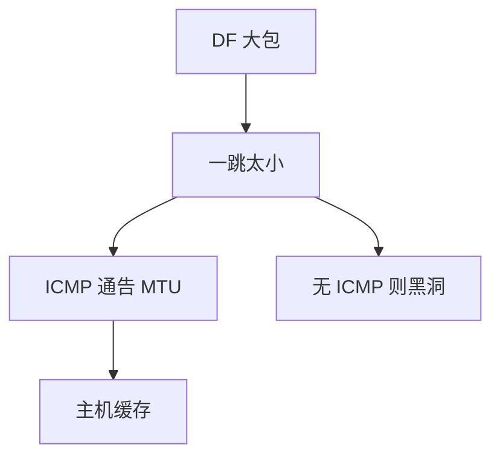

# 路径 MTU 发现

把 DF 置位，让太小的一跳用 ICMP 报告；过滤 ICMP 就把发现变成黑洞，主机只能靠探测或保守 1280/576。

<footer>—— 据 RFC 1191；RFC 8201 IPv6 PMTUD；RFC 4821 分组化 PLPMTUD 整理</footer>

[巨帧](/cs/jumbo-mtu) 与 [GRE](/cs/gre-tunnels)、[VXLAN](/cs/vxlan-overlay)、[IPv6 过渡](/cs/ipv6-transition) 都吃 MTU。[上一课](/cs/ipv6-transition) 留下隧道头税。缺口是**沿路最小 MTU 怎么发现**。本课不把 traceroute 写完。

## 问题

源不知道路径。IPv4 PMTUD：DF=1，路由器丢弃并 ICMP Fragmentation Needed。IPv6 无源分片，只能这样。黑洞：中间丢大包且不回 ICMP（防火墙「安全」），TCP 卡住。PLPMTUD：传输层用探测与丢失推断，不依赖 ICMP。MSS 钳制后课会在边缘傻切，是权宜。

不要把 PMTUD 写成一次性：路由变化、ECMP 不同成员，最小 MTU 会变。

RFC 4821 针对黑洞。IPv6 最小链路 MTU 1280。本课不把每个 ICMP 代码背完。

### ICMP 被滤则黑洞

IPv6 必须发现。PLPMTUD 用传输探测。ECMP 与隧道使缓存失效。统一 MTU 可省掉发现。

## 方法

画：发大包 → ICMP → 降 MTU → 缓存。对照分片：中间分片与端到端发现，Saltzer 偏向端。隧道口应发 ICMP 或预先降低。

方法止于选定对象与对照；机制才说它如何嵌入已有分层与主干课。

## 机制

卫星与 5G 切片不改算法，只改 RTT，探测更慢。交换机巨帧不一致是二层版同一 bug。多播很少做 PMTUD，常用保守长度。安全：ICMP 可被伪造来缩小 MTU 做攻击，主机要合理性检查。

与容量无关：MTU 摊头税，不提高 $C$。

## 边界

本课不引入 IPv6 原子分片扩展头的全部争议。TTL 与 traceroute 是下一课。后课默认：路径 MTU 靠 ICMP 或传输探测；过滤 ICMP 要给发现留洞。

数据中心可全路径统一 9000，省掉发现，这是运营契约。

上一课留下的缺口在本课收口；「路径 MTU 发现」进入后课词汇表后只引用。文献用来钉对象与边界，不把本课写成该主题的独立综述。下一课[TTL 与 traceroute](/cs/ttl-traceroute)。

## 小结

- DF + ICMP 发现最小 MTU；IPv6 必须。
- ICMP 被滤则黑洞，用 PLPMTUD。
- 隧道与 ECMP 使缓存失效。
- 后课只引用本课钉死的对象，不从该领域总问题重开。
- 出处：RFC 1191；RFC 8201；RFC 4821。
