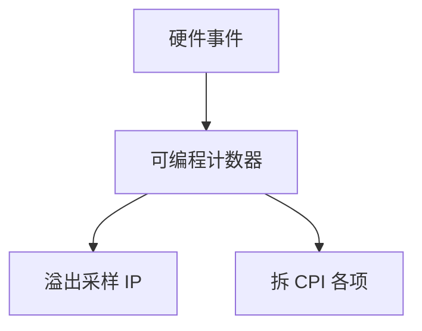

# 性能计数器 PMU

把 CPI 拆成：周期、指令、缺失、误预测、停顿原因；计数器在核里，采样或累计，读的是这台机器上这个二进制，不是 SPEC 几何平均。

<footer>—— 据 Intel SDM 对 PEBS/PMU 的描述；Hennessy and Patterson, CA:AQA 整理</footer>

[上一课](/cs/spec-benchmark-pitfalls) 警告总分。设计者与调优者需要把 [CPI 公式](/cs/cpi-amdahl) 的每一项变成可观测事件。本课不重讲 SPEC 规则。缺口是 **PMU：硬件事件、如何对应到本课序里的结构（IQ、LSQ、预取、NoC）。**

## 问题

「程序慢」可能是 [TAGE](/cs/tage-predictor) 误预测、LLC miss、[伪共享](/cs/false-sharing)、fence 过多。没有计数器就只能猜。缺口不是 gem5 全系统模拟（下一课），而是**片上已经埋的计数器：固定事件 + 可编程事件，溢出中断做采样。**

Intel 的 architectural 事件较稳；微结构事件随代际改名。ARM SPE、RISC-V 的 HPM 是同一层。本课讲机制，不绑定某一 `perf` 子命令教程。

## 方法

累计：一段时间读 `cycles`、`instructions`、`cache-misses`、`branch-misses`。采样：每 N 事件记 IP，找热点。点名到结构：L1D miss、L2 miss、DTLB miss、资源停顿（ROB 满、IQ 满）、预取有用/无用（若实现提供）。多核：按核、按 cgroup 看，对照 [分区](/cs/cache-partition-qos)。

## 机制

计数不是完美：超线程争用、乱序导致「事件归属哪条指令」模糊、PEBS 有偏。但仍比只看墙钟有用。安全：PMU 也是侧信道的时钟源，后课 Spectre 只要求知道「时序可测」，本课不讲如何测缓存。

自上而下（top-down）剖析把周期分成前端饥饿、后端、退休、坏推测四类，正好对应本课序的前端带宽、IQ/LSQ、ROB 头、误预测。先看大类再下钻事件，避免对着两百个计数器盲调。

## 边界

本课不保证所有停顿原因都有架构级事件。gem5 下一课在模拟里把这些事件变得「可完美计数」，但有速度误差。Roofline 用带宽与 FLOP 计数画图，常从 PMU 或剖析器来。

后课默认：优化先看 PMU 拆项。算术强度与两堵墙用 Roofline 画。

## 小结

- PMU 把 CPI 拆成可观测事件，针对本机本程序。
- 归属与超线程会引入噪声。
- Roofline 把带宽墙与计算墙画在一张图上，下一课。
- 出处：Intel SDM；Hennessy and Patterson, *CA:AQA*。
