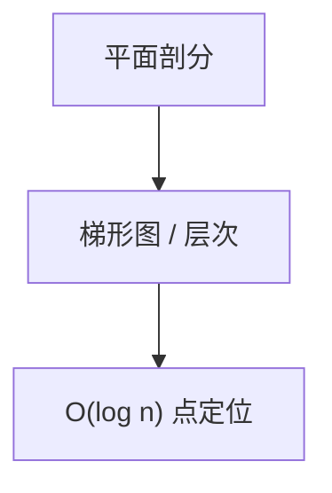

# 点定位

平面剖分成面后，询问点落在哪一面：梯形图或 Kirkpatrick 层次，$O(n)$ 空间 $O(\log n)$ 查询。

<footer>—— 据 Kirkpatrick, Optimal Search in Planar Subdivisions, 1983；Mulmuley、Seidel 随机增量梯形图整理</footer>

上一课[Voronoi 与 Delaunay](/cs/voronoi-delaunay)给出剖分。缺口是查询：点 $q$ 在哪个面/哪条 Delaunay 边的哪侧。朴素 $O(n)$ 走。本课点定位结构。不重写 Fortune。后课几何精度。

## 问题

梯形图：过每个顶点作竖线直到撞边，面变梯形。随机增量期望 $O(n)$ 大小、$O(\log n)$ 历史 DAG 查询。Kirkpatrick：独立集收缩层次，$\log$ 层。步行（沿 Delaunay 走）实践快但最坏差。

缺口是数据结构，不是再三角化。

### 不是最近邻本身

最近站点可用 Voronoi 定位，或 k-d 树。本课一般剖分。k-d 树是正交，点名。

Kirkpatrick 1983。CGAL 实现随机梯形图。后课鲁棒性：定位依赖谓词符号。

## 方法

预处理剖分。询问沿 DAG 或层次下降。动态插入更重（随机增量在线）。

与扫描线：梯形图常随机增量不是从左扫一次完。

## 机制

每层面数减常因子，查询下降对数。历史 DAG 记录「被谁切开」。与二叉搜索树：几何键是区域包含。与半平面：对偶可把某些定位变成凸包切。

## 边界

本课不写三维点定位。动态删点不写。后课默认：静态剖分 $O(\log n)$ 定位。下一课几何精度与鲁棒性。

## 小结

- 剖分查询用梯形图或 Kirkpatrick。
- $O(n)$ 空间、$O(\log n)$ 查询。
- 步行实用、最坏弱。
- 出处：Kirkpatrick, 1983；随机增量梯形图。
