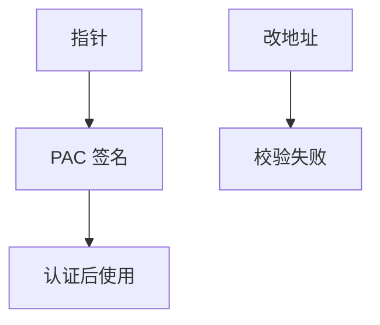

# 指针认证 PAC

ARMv8.3 把短 MAC 塞进指针闲置位：改地址而不重签，使用时校验失败。密钥在内核/EL 管理，用户态任意写不再能静默改返回地址或函数指针。

<footer>—— ARM ARM 对 PAC 的描述；Qualcomm/Apple 的工程叙述；对照 Liljestrand 等对 PAC 的分析</footer>

## 定位

上一课[CET](/cs/shadow-stack-cet)是 x86 的硬件 CFI。缺口是**ARM 的指针签名**：PAC。本课讲签什么、密钥在哪，不给伪造 PAC 的步骤。

后课默认已经读完本课钉下的合同，只补差，不从该领域第一性原理重开。

## 问题

64 位指针有闲置位。PAC：对地址与上下文（SP）算短标签。返回地址、函数指针可签。缺口是密钥泄漏与位宽（碰撞）——只陈述余量有限，要配合其他缓解。

### 不是加密内存

数据载荷仍明文。PAC 管指针完整性。

ARM Pointer Authentication。Linux `HWCAP_PACA`。本课禁止绕过教程。

## 方法

对照 CET：一个管边，一个管指针值。二者可叠。指出内核与用户密钥分离。下一课：从硬件缓解走到语言迁移。

图中节点是本课的机制骨架；课程不把图展开成可运行的攻击步骤。

## 机制

控制数据的完整性终于有了指令级标签。根治仍是少写 C。下一课内存安全语言迁移：类型与所有权进编译器。

前提写进合同之后，游戏外的误用只当失败模式点名，不在本课写成操作程序。

## 边界

本课不分析 PAC 碰撞构造。内存安全语言下一课。

## 小结

- CET 钉边；PAC 钉指针值。
- 短 MAC 在闲置位；密钥在更高特权。
- 余量有限，须叠加。
- 下一课内存安全语言。
- 出处：ARM ARM；Liljestrand et al.；对照 Intel CET。
