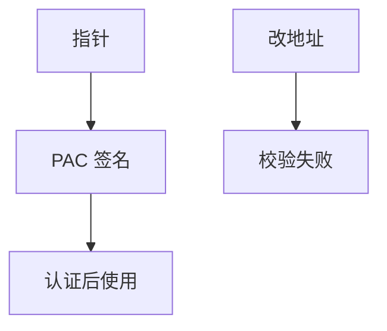
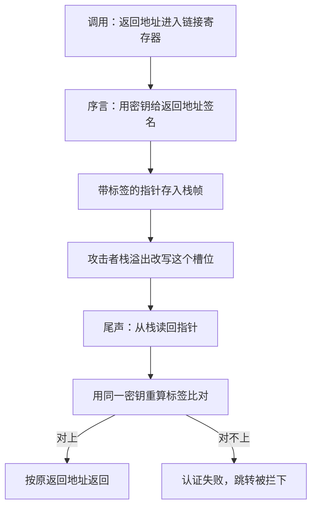

# 指针认证 PAC

ARMv8.3 把短 MAC 塞进指针闲置位：改地址而不重签，使用时校验失败。密钥在内核/EL 管理，用户态任意写不再能静默改返回地址或函数指针。

<footer>—— ARM ARM 对 PAC 的描述；Qualcomm/Apple 的工程叙述；对照 Liljestrand 等对 PAC 的分析</footer>

上一课[CET](/cs/shadow-stack-cet)是 x86 侧的硬件 CFI：影子栈钉住控制流转移的边。本课补 ARM 一侧的缺口——**指针签名**（PAC，ARMv8.3 起）：改地址而不重签，使用时校验失败。本课讲两件事：签什么、密钥放在哪；不给伪造 PAC 的步骤。

后课默认已经读完本课钉下的合同，只补差，不从该领域第一性原理重开。

## 问题

64 位虚拟地址用不满高位，指针里留有闲置位。PAC 用掉它们：对「地址 + 上下文（如 SP）」用密钥算一个短标签，替换进闲置位；写入时签名，取用前认证。返回地址、函数指针这类一旦被改就能劫持控制流的数据都可签。攻击者若改了地址而不重签，认证时标签对不上，跳转即失败。缺口有二：密钥若泄漏，签名形同虚设；标签位宽有限，有碰撞可能。本课只陈述余量有限，PAC 须与其他缓解配合，不当唯一防线。

### 不是加密内存

常见误读是「PAC 加密了内存」：并没有。数据载荷仍是明文，PAC 只管**指针值本身**的完整性——没签过的指针照常用，签过但被改的指针报错。保密性归加密与特权隔离管。

ARM Pointer Authentication。Linux 以 `HWCAP_PACA` 报告支持。PAC 密钥（APIA、APDB 等）由 EL1/EL2 写入系统寄存器，用户态读不到。本课禁止绕过教程。

PAC 的标签本质是 MAC（消息认证码）：拿「指针值 + 上下文」用密钥算一段短校验码。类比快递箱上的一次性封条——箱号（地址）换过，封条就对不上；而想撕掉重贴，需要总部（更高特权级）才有的独家胶水（密钥）。

数字实例：常见 ARM64 实现给 PAC 留 7~16 个高位。若标签有 16 位，随机瞎改一个已签指针、恰巧通过校验的概率约 $2^{-16}$，即六万五千分之一；而且认证失败通常直接抛异常，攻击者连大规模重试的机会都没有。

## 方法

方法是与 CET 对照着读：CET 的影子栈管**边**（返回必须落回影子栈记录的地址），PAC 管**指针值**（指针被改则认证失败），保护对象不同，可以叠加。密钥按特权分离：内核与用户态各用各的密钥寄存器，用户态的任意写构造不出内核的签名。下一课：从硬件缓解走到语言迁移。

```mermaid
flowchart TD
  P["指针"] --> SIGN["PAC 签名"]
  SIGN --> USE["认证后使用"]
  TAMPER["改地址"] --> FAIL["校验失败"]
```

## 机制

机制要点是认证时机：签名与认证成对出现在函数序言与尾声（或编译器插入的位置），任何未经认证的写都无法把改过的指针送进间接跳转；短 MAC 的安全性在于「改地址必须重签，重签需要密钥」。控制数据的完整性由此有了指令级标签，但这是缓解不是根治——内存破坏仍在，只是被转化为可观测的失败；根治仍是少写 C。下一课内存安全语言迁移：类型与所有权进编译器。

一次受 PAC 保护的函数调用，返回地址的一生：

```mermaid
flowchart TD
  CALL["调用：返回地址进入链接寄存器"] --> SIGN["序言：用密钥给返回地址签名"]
  SIGN --> STORE["带标签的指针存入栈帧"]
  STORE --> ATTACK["攻击者栈溢出改写这个槽位"]
  ATTACK --> LOAD["尾声：从栈读回指针"]
  LOAD --> AUTH["用同一密钥重算标签比对"]
  AUTH -->|"对上"| RET["按原返回地址返回"]
  AUTH -->|"对不上"| TRAP["认证失败，跳转被拦下"]
```

常见误区：以为开了 PAC 内存就被加密、指针就「不可写」。数据照旧明文可写，没签过名的指针（比如堆上的普通数据指针）完全不受保护——PAC 只拦「被签名的控制数据被改」这一条路，所以说它是缓解，不是根治。

## 边界

本课不分析 PAC 碰撞的构造，也不给绕过案例。内存安全语言下一课。

## 小结

- CET 钉控制流的边；PAC 钉指针值本身。
- 短 MAC 藏在指针闲置位；密钥由更高特权持有。
- 位宽有限、密钥可泄漏，须与其他缓解叠加。
- 下一课内存安全语言。
- 出处：ARM ARM；Liljestrand et al.；对照 Intel CET。
