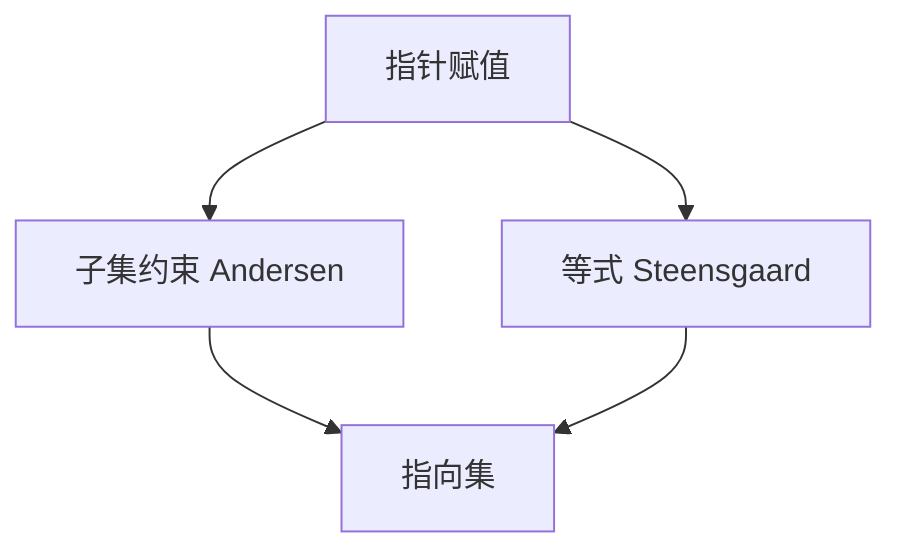

# 指向分析 Andersen / Steensgaard

Andersen 把赋值当子集约束，精确、偏立方；Steensgaard 用并查集把指针等同，近线性、更粗。二者都给出每个指针的指向集。

<footer>—— 据 Andersen, Program Analysis and Specialization, 1994；Steensgaard, Points-to Analysis in Almost Linear Time, 1996 整理</footer>

上一课[别名分析](/cs/alias-analysis)要指向集才能回答 May。缺口是**怎么算指向**：`p=&x`、`p=q`、`*p=q`、`p=*q`。Andersen：包含约束，解得较小集合。Steensgaard：等式，快。本课钉约束形态，不写全部流敏感变体。

## 问题

流不敏感、上下文不敏感是基线：每个变量一个指向集，忽略顺序。`p=&a; p=&b` 则 $p$ 指向 $\{a,b\}$。缺口是**约束求解**，不是 TBAA。

字段敏感 vs 不敏感：结构体字段分开或塌成一块。堆：按分配点（allocation site）抽象对象。

### 并查集不是子集

Steensgaard 把 `p=q` 变成 $p$ 与 $q$ 同类，指向集并在一起，之后无法分开，故更粗。Andersen 的 `p=q` 是 $\mathrm{pts}(q)\subseteq\mathrm{pts}(p)$。

Andersen 1994 博士论文。Steensgaard 1996 PLDI。Hind 的综述可对照。本课不写完整 IFDS。

## 方法

建约束。Andersen：迭代或差分解直到不动点。Steensgaard：union-find 加间接边处理 `*p`。查询：`pts(p)∩pts(q)` 空则 No alias（对指针值）。

与调用：函数指针使调用图与指向分析互相依赖——下一课。

## 机制

流敏感更精，代价高。上下文敏感（克隆或摘要）减过程间混淆。实用编译器常：Steensgaard 或 Andersen 的限迭代 + TBAA。

不要把指向集当运行时 GC 的根扫描图；GC 要精确栈图，另一接口。

## 边界

本课不写 C++ 虚调用的全部 devirtualize。后课默认：指向分析提供 May 别名。下一课过程间与调用图。

也不把分析当病毒扫描。

## 小结

- Andersen：子集，较精较慢；Steensgaard：并查，较快较粗。
- 分配点抽象堆对象。
- 与调用图可联立。
- 出处：Andersen, 1994；Steensgaard, 1996。
