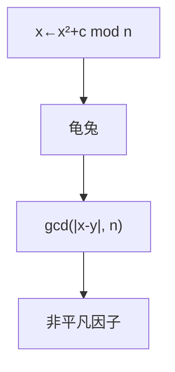

# Pollard rho

伪随机迭代在模 $n$ 上走，Floyd 判圈；$\gcd(|x-y|,n)$ 给出因子，期望 $\tilde O(n^{1/4})$ 级。

<footer>—— 据 Pollard, A Monte Carlo Method for Factorization, 1975；CLRS 第 31.9 节整理</footer>

上一课[BSGS](/cs/bsgs)在已知阶的群上根号搜对数。本课 $n$ 合数，求非平凡因子。试除 $O(\sqrt n)$。缺口是 Pollard rho：生日悖论在因子 $p$ 的环上碰撞。不重写 Miller–Rabin 素性。后课 Lucas 换组合数。

## 问题

$n=pq$ 时，映射 $f(x)=x^2+c\bmod n$ 在模 $p$ 下进入短环。Floyd：龟兔 $x,f(x)$ 与 $f(f)$。$\gcd(|x_i-x_j|,n)$ 非 1 非 $n$ 则因子。期望时间约 $O(n^{1/4})$（对最小素因子 $p$ 为 $O(\sqrt p)$）。失败换 $c$。

Brent 变体少算 $f$。Pollard $p-1$ 是另一算法（光滑阶），点名。

### 不是素性测试

rho 假定 $n$ 合数。先 Miller–Rabin。素数上 gcd 总是 1 或 $n$。不要对素数跑 rho 当分解。

Pollard 1975。CLRS 31.9。二次筛、NFS 分解大整数，本课 rho 适合 60–80 位因子量级直觉。后课 Lucas 定理。

## 方法

随机 $x_0,c$。Floyd 循环。每次 gcd。得到因子后递归分解。完全平方先开方。

离散对数的 rho 用函数在陪集上，点名。

## 机制

生日：模 $p$ 约 $\sqrt p$ 步碰撞，碰撞差是 $p$ 的倍数。Floyd 空间 $O(1)$。与 BSGS：对数要哈希表；rho 分解用 gcd。随机化 Las Vegas/Monte Carlo 分类后课再钉。

## 边界

本课不写 NFS。不写椭圆曲线分解（Lenstra ECM）全文。后课默认：中等因子用 rho。下一课 Lucas 定理。

## 小结

- $f$ 迭代 + Floyd + gcd 出因子。
- 期望依赖最小素因子的根号。
- 先确认合数。
- 出处：Pollard, 1975；CLRS 第 31.9 节。
