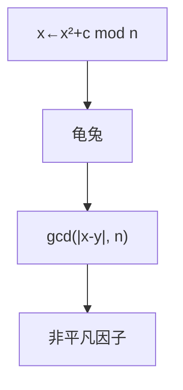
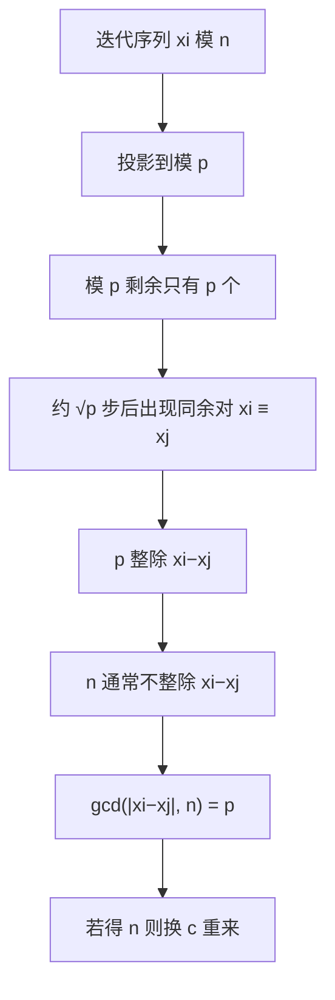

# Pollard rho

伪随机迭代在模 $n$ 上走，Floyd 判圈；$\gcd(|x-y|,n)$ 给出因子，期望 $\tilde O(n^{1/4})$ 级。

<footer>—— 据 Pollard, A Monte Carlo Method for Factorization, 1975；CLRS 第 31.9 节整理</footer>

上一课[BSGS](/cs/bsgs)在阶已知的群里根号搜离散对数；本课对象换成合数 $n$，目标是求非平凡因子。试除要 $O(\sqrt n)$，$n$ 上到几十位就不可行。缺口是 Pollard rho：把生日悖论搬到因子 $p$ 的环上找碰撞。生日悖论直觉：一个房间只需约 $1.2\sqrt{365}\approx 23$ 人，就有过半概率两人同生日——随机取值之间发生碰撞远比想象快。rho 正是利用这一点：随机迭代约 $\sqrt p$ 步就可能撞出两个模 $p$ 相同的值，而不是把 $p$ 个值挨个试完。本课不重写 Miller–Rabin 素性；后课 Lucas 换回组合数。

## 问题

$n=pq$ 时，迭代 $f(x)=x^2+c\bmod n$ 在模 $p$ 的投影里进入一个短环，撞环步数只有 $O(\sqrt p)$。我们看不见 $p$，但 Floyd 龟兔（一个走一步、一个走两步）无需知道环长就能找到模 $p$ 同余的相遇点 $x_i\equiv x_j$；此时 $\gcd(|x_i-x_j|,n)$ 撞出既非 $1$ 也非 $n$ 的因子。期望步数 $O(\sqrt p)$，对最小素因子即 $O(n^{1/4})$ 量级；gcd 失败（恰得 $n$）就换参数 $c$ 重来。

Brent 变体重排 gcd 时机，省掉大量 $f$ 求值；Pollard $p-1$ 是另一条路（赌 $p-1$ 光滑），点名即可。

### 不是素性测试

rho 假定 $n$ 是合数：$n$ 为素数时迭代只在模 $n$ 自身的环上走，gcd 恒为 $1$ 或 $n$，永远撞不出因子。所以流程是先 Miller–Rabin 确认合数，再跑 rho；不要对素数跑 rho 充当分解。

Pollard 1975。CLRS 31.9。二次筛、NFS 分解大整数，本课 rho 适合 60–80 位因子量级直觉。后课 Lucas 定理。

## 方法

操作序列：随机选 $x_0$ 与 $c$；推进 Floyd 循环；每步（或按 Brent 的批量节拍）算一次 gcd；拿到因子 $d$ 后对 $d$ 与 $n/d$ 递归分解。动手前先查完全平方——有平方因子先开方，免得两支相同因子空转。

```mermaid
flowchart TD
  F["x←x²+c mod n"] --> FLOYD["龟兔"]
  FLOYD --> G["gcd(|x-y|, n)"]
  G --> FAC["非平凡因子"]
```

龟兔判圈可以想象成两名跑者在同一环形跑道上以一倍速和两倍速起跑：只要跑道是环，快者一定会从后面追上慢者——不需要知道跑道多长，也无需记住谁到过哪里。这就是 Floyd 算法只用两个变量就替代哈希表的原因。

离散对数也有 rho 版本，用陪集上的随机函数游走找碰撞，点名即可。

## 机制

机制是生日悖论在模 $p$ 上起作用：$O(\sqrt p)$ 个值就有相当概率出现一对模 $p$ 同余，碰撞差 $x_i-x_j$ 是 $p$ 的倍数而 $n$ 整体不是——gcd 一筛就是因子。Floyd 的妙处在空间 $O(1)$：不存历史，用两倍速指针替代哈希表。与 BSGS 对照鲜明：求对数要哈希表存 $\sqrt q$ 项，分解只需 gcd。rho 每次输出的因子都经 gcd 验证，不会给错答案；Las Vegas 与 Monte Carlo 的严格分类后课再钉。

```mermaid
flowchart TD
  A["迭代序列 xi 模 n"] --> B["投影到模 p"]
  B --> C["模 p 剩余只有 p 个"]
  C --> D["约 √p 步后出现同余对 xi ≡ xj"]
  D --> E["p 整除 xi−xj"]
  E --> F["n 通常不整除 xi−xj"]
  F --> G["gcd(|xi−xj|, n) = p"]
  G --> H["若得 n 则换 c 重来"]
```

常见误区：初学者容易以为 gcd 每次都能干净地吐出 $p$。实际上碰撞可能“撞过头”——好几个不同的模 $p$ 值同时同余，使 $p^2$ 整除差值，gcd 直接给出 $n$。此时算法并没有错，只需换一个常数 $c$（或起点 $x_0$）重新迭代，失败概率约每次一半。

## 边界

本课不写数域筛 NFS，也不展开 Lenstra 的椭圆曲线分解 ECM；量级边界在 marginnote：rho 适合中等因子，大整数要二次筛与 NFS。后课默认：中等因子用 rho。下一课 Lucas 定理。

## 小结

- $f$ 迭代 + Floyd + gcd 出因子。
- 期望依赖最小素因子的根号。
- 先确认合数。
- 出处：Pollard, 1975；CLRS 第 31.9 节。
