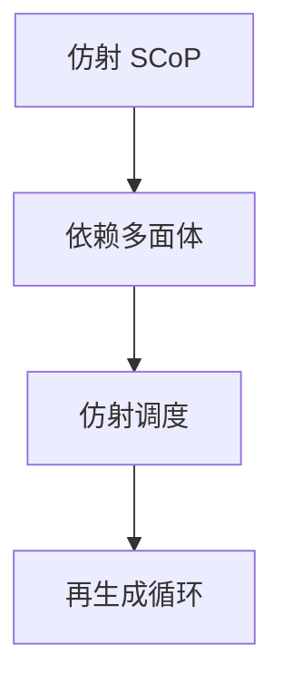

# 多面体模型

静态控制部分的迭代域是多面体，依赖是仿射关系。调度用仿射变换同时表达交换、分块、并行与向量化。

<footer>—— 据 Feautrier, Some Efficient Solutions to the Affine Scheduling Problem；Bastoul, Code Generation in the Polyhedral Model；Bondhugula 等 Pluto 整理</footer>

上一课[自动向量化](/cs/auto-vectorization)在最内层做局部判定。缺口是**统一代数**：SCoP（static control part）里，循环界与下标为仿射，迭代点是 $\mathbb{Z}^n$ 的多面体。Feautrier 调度、Pluto 自动分块。本课钉模型边界，不把整数规划求解器写完。

## 问题

手写交换/分块/向量化各一套启发式，组合爆炸。多面体：依赖多面体 + 求仿射调度函数，使依赖边时间增加。缺口是**何时程序落进模型**（无 `while` 未知界、无间接下标），不是 SIMD 掩码细节。

代码生成：扫描多面体重新吐循环（CLooG 等）。

### 多面体不是「所有循环」

链表、`while (p)`、`a[b[i]]` 通常出模型。编译器只对检测出的 SCoP 启用。不要声称整个 C 程序都在多面体里。

Feautrier 1990s。Wilde/Bastoul CLooG。Bondhugula Pluto。Polly（LLVM）、Graphite（GCC）。本课不进 polyhedral compilation 的全部 ILP 技巧。

## 方法

抽取 SCoP。建依赖。解调度（最小化通信、最大化内层并行）。生成循环。再跑向量化。失败则保持原循环。

与[抽象解释](/cs/abstract-interpretation)：多面体是精确的迭代集表示，不是区间那么粗，但适用范围窄。

## 机制

编译时间：ILP 可能爆。实用：限维、限语句数。浮点结合与并行归约仍要语言许可。

不要把多面体当 GPU 自动生成的全部（还要共享内存映射等）。

## 边界

本课不写 Pluto 目标函数全文。后课默认：仿射嵌套可用多面体统一变换。下一课别名：模型外与模型内都要回答「是否同一位置」。

也不把线性规划当本课的优化对象（那是算法课）。

## 小结

- 多面体：迭代域与仿射依赖 + 调度变换。
- 只覆盖 SCoP；间接与 while 排除。
- 生成后再接向量化与分块目标。
- 出处：Feautrier；Bastoul；Bondhugula et al. Pluto。
