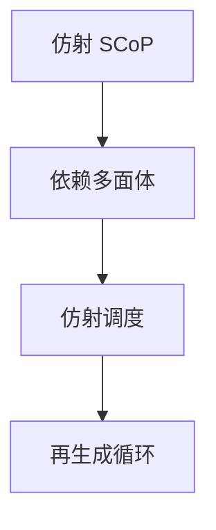
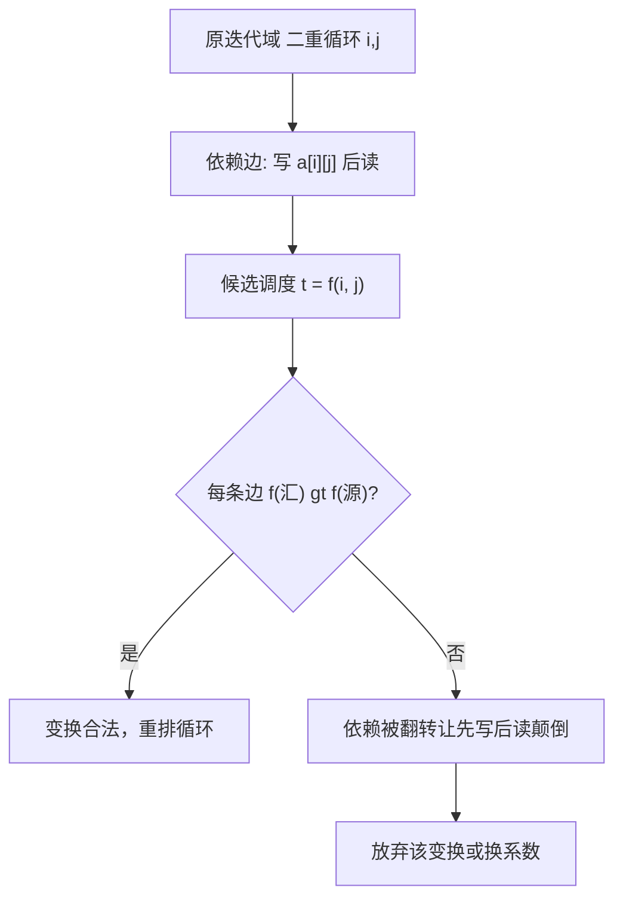

# 多面体模型

静态控制部分的迭代域是多面体，依赖是仿射关系。调度用仿射变换同时表达交换、分块、并行与向量化。

<footer>—— 据 Feautrier, Some Efficient Solutions to the Affine Scheduling Problem；Bastoul, Code Generation in the Polyhedral Model；Bondhugula 等 Pluto 整理</footer>

上一课[自动向量化](/cs/auto-vectorization)在最内层做局部判定。缺口是**统一代数**：SCoP（static control part）里，循环界与下标为仿射，迭代点是 $\mathbb{Z}^n$ 的多面体。Feautrier 调度、Pluto 自动分块。本课钉模型边界，不把整数规划求解器写完。

## 问题

手写交换/分块/向量化各一套启发式，组合爆炸。多面体：依赖多面体 + 求仿射调度函数，使依赖边时间增加。「仿射」翻译成大白话就是「线性 + 平移」：形如 $2i+3j+1$ 的表达式（常数乘变量再相加，允许加常数），而 $i \cdot j$ 或 $i$ 是奇数时才执行这类判断都不算。循环界与数组下标只要全是这种形状，就能被代数符号整体操作。缺口是**何时程序落进模型**（无 `while` 未知界、无间接下标），不是 SIMD 掩码细节。

代码生成：扫描多面体重新吐循环（CLooG 等）。

### 多面体不是「所有循环」

链表、`while (p)`、`a[b[i]]` 通常出模型。编译器只对检测出的 SCoP 启用。不要声称整个 C 程序都在多面体里。

Feautrier 1990s。Wilde/Bastoul CLooG。Bondhugula Pluto。Polly（LLVM）、Graphite（GCC）。本课不进 polyhedral compilation 的全部 ILP 技巧。

## 方法

抽取 SCoP。建依赖。解调度（最小化通信、最大化内层并行）。生成循环。再跑向量化。失败则保持原循环。

```mermaid
flowchart TD
  SCOP["仿射 SCoP"] --> DEP["依赖多面体"]
  DEP --> SCH["仿射调度"]
  SCH --> GEN["再生成循环"]
```

直觉类比：迭代域像一块水晶——每个整数格点是一次循环迭代，循环界就是切割水晶的平面。交换循环相当于换一个方向看这块晶体，分块相当于沿格线把它切成小方块。变换只动「怎么看」，不动「晶体本身」，所以代数上统一、可组合。

与[抽象解释](/cs/abstract-interpretation)：多面体是精确的迭代集表示，不是区间那么粗，但适用范围窄。

## 机制

编译时间：ILP 可能爆。实用：限维、限语句数。浮点结合与并行归约仍要语言许可。

调度合法性的判定机械但关键：对每条依赖边（源点、汇点），要求新调度给汇点分配的时间严格晚于源点。所有候选变换都要过这一关，一条边违例整个变换作废。

```mermaid
flowchart TD
  A["原迭代域 二重循环 i,j"] --> B["依赖边: 写 a[i][j] 后读"]
  B --> C["候选调度 t = f(i, j)"]
  C --> D{"每条边 f(汇) gt f(源)?"}
  D -- "是" --> E["变换合法，重排循环"]
  D -- "否" --> F["依赖被翻转让先写后读颠倒"]
  F --> G["放弃该变换或换系数"]
```

初学者容易以为循环交换总是安全的。实际上若内层读的正是外层上一轮写的元素（如按行写、按列读），交换后「后用的」反而先执行，结果全错——多面体调度就是用 $f(\text{汇}) \gt f(\text{源})$ 这一条不等式把这类错误在编译期拦下来。

不要把多面体当 GPU 自动生成的全部（还要共享内存映射等）。

## 边界

本课不写 Pluto 目标函数全文。后课默认：仿射嵌套可用多面体统一变换。后课别名：模型外与模型内都要回答「是否同一位置」。

也不把线性规划当本课的优化对象（那是算法课）。

## 小结

- 多面体：迭代域与仿射依赖 + 调度变换。
- 只覆盖 SCoP；间接与 while 排除。
- 生成后再接向量化与分块目标。
- 出处：Feautrier；Bastoul；Bondhugula et al. Pluto。
