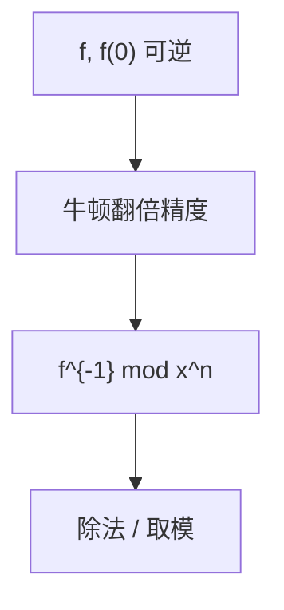

# 多项式求逆与除法

常数项可逆则幂级数可牛顿迭代求逆；多项式除法变成乘逆再截断，复杂度与乘法同阶。

<footer>—— 据 Kung, On Computing Reciprocals of Power Series, 1974；CLRS 第 30 章整理</footer>

上一课[NTT](/cs/ntt)给出精确乘。多项式还要除、求 $\bmod$、$ln/\exp$。缺口是**乘法级**的求逆：牛顿迭代 $g\leftarrow 2g-fg^2$，精度翻倍。不重写 NTT 蝶形。后课 Strassen 换矩阵。本课形式幂级数在 $x=0$ 邻域，次数 $n$ 截断。

## 问题

$f(0)\neq 0$（或模 $p$ 可逆）。求 $g$ 使 $fg\equiv 1\pmod{x^n}$。牛顿：从 $g_0=f(0)^{-1}$ 起，每次把正确位数加倍，每步一次到两次卷积。总 $O(M(n))$，$M$ 为乘法复杂度。带余除法：$f=qh+r$，$\deg r<\deg h$，高次逆用 $x^n f(1/x)$ 的倒数再翻转。

缺口是牛顿，不是 $O(n^2)$ 的长除。

### 牛顿不是数值根查找的同一课

这里在环 $k[[x]]/(x^n)$ 里迭代，精度是次数。数值牛顿解 $F(z)=0$ 是另一对象。同名不同结构。

Kung 1974 幂级数倒数。Sieveking 同类。多项式代数的半 gcd、结果子后课不插。生成函数后课用这些工具。

## 方法

求逆牛顿。除法：反转、乘逆、截断、再反转。取模 $f\bmod h$ 即余式。需要 $f$ 的 $\exp/\ln$ 时同样牛顿，本课点名。

乘法用 NTT 或 Karatsuba。

## 机制

若 $fg=1+O(x^m)$，则 $g'=2g-fg^2$ 满足 $fg'=1+O(x^{2m})$。与标量牛顿 $x\leftarrow x(2-ax)$ 求 $1/a$ 同形。除法高次对齐是多项式的「小数点」。与整数除法 Knuth D：整数牛顿也可到乘法级，本课以多项式为主。

## 边界

本课不写多点求值/插值全文（可 $O(M(n)\log n)$）。不写因式分解。后课默认：多项式逆、除与乘同阶。下一课 Strassen 矩阵乘。

## 小结

- 牛顿把求逆做到乘法级。
- 除法 = 反转 + 逆 + 截断。
- 次数精度翻倍，总 $O(M(n))$。
- 出处：Kung, 1974；CLRS 第 30 章。
