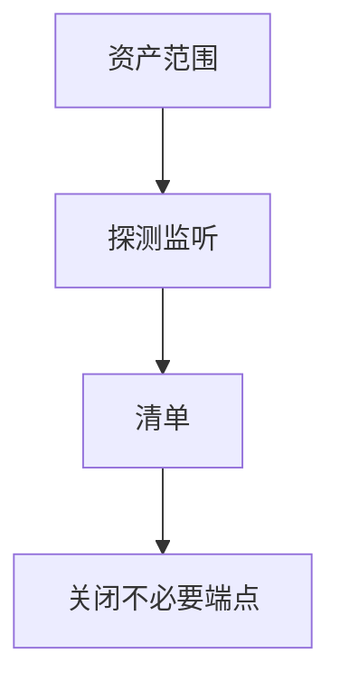

# 端口扫描与 Nmap

扫描是问哪些传输端点在听。防御侧用它做资产盘点；同一技术也被侦察使用。课程讲可见性与减少暴露，不把扫描写成对他人网络的操作指南。

<footer>—— 据 Fyodor, Nmap Network Scanning；对照 RFC 793 对连接状态的语义</footer>

## 定位

上一课[DDoS](/cs/ddos-mitigation)是过量。缺口是**发现**：暴露了哪些端口。本课从资产与加固角度谈扫描，不提供对未授权目标的扫描步骤。

后课默认已经读完本课钉下的合同，只补差，不从该领域第一性原理重开。

## 问题

只开必要端口。扫描自己的范围以核对防火墙。缺口是：影子 IT、IPv6、出站也要盘。Nmap 是常见实现名字，机制是探测与指纹——指纹用于识别过时服务以便补丁。

### 授权

只扫你有权扫的范围。外网扫描别人是另一回事。

Fyodor 的书是工具文档。本课禁止把内容当攻击演练脚本。分段下一课缩小可达性。

## 方法

对照 TCP 握手可见性、过滤与黑洞。用扫描结果驱动关闭默认服务。下一课网络分段。

图中节点是本课的机制骨架；课程不把图展开成可运行的攻击步骤。

## 机制

攻击面度量。分段让即使端口开着也只对该区可见。默认配置下一课继续关不必要服务。

前提写进合同之后，游戏外的误用只当失败模式点名，不在本课写成操作程序。

## 边界

不对他人网络给步骤。网络分段下一课。

## 小结

- 洪水是容量；扫描是发现暴露。
- 用于自己的资产盘点与关端口。
- 授权范围先于工具。
- 下一课网络分段。
- 出处：Fyodor, *Nmap Network Scanning*；RFC 793。
