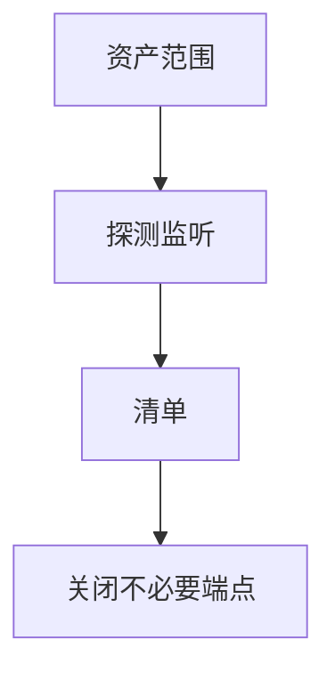
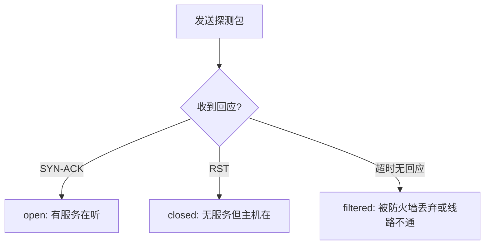

# 端口扫描与 Nmap

扫描是问哪些传输端点在听。防御侧用它做资产盘点；同一技术也被侦察使用。课程讲可见性与减少暴露，不把扫描写成对他人网络的操作指南。

<footer>—— 据 Fyodor, Nmap Network Scanning；对照 RFC 793 对连接状态的语义</footer>

上一课[DDoS](/cs/ddos-mitigation)是过量。缺口是**发现**：暴露了哪些端口。本课从资产与加固角度谈扫描，不提供对未授权目标的扫描步骤。

后课默认已经读完本课钉下的合同，只补差，不从该领域第一性原理重开。

## 问题

只开必要端口。扫描自己的范围以核对防火墙。缺口是：影子 IT、IPv6、出站也要盘。「影子 IT」指员工绕过审批私自私自搭起的服务——某台开发机上临时起的数据库、忘了关的测试服务器。它们不在资产清单里，却实实在在开着端口监听，往往是攻击者最先落脚的地方，所以盘点要比对扫描结果而不是只信台账。Nmap 是常见实现名字，机制是探测与指纹——指纹用于识别过时服务以便补丁。

### 授权

只扫你有权扫的范围。外网扫描别人是另一回事。

Fyodor 的书是工具文档。本课禁止把内容当攻击演练脚本。分段下一课缩小可达性。

## 方法

对照 TCP 握手可见性、过滤与黑洞。用扫描结果驱动关闭默认服务。下一课网络分段。

```mermaid
flowchart TD
  ASSET["资产范围"] --> PROBE["探测监听"]
  PROBE --> INV["清单"]
  INV --> CLOSE["关闭不必要端点"]
```

数字实例：端口号是 $0$ 到 $65535$ 的编号，相当于一台机器门牌下的六万多个分机号。常见服务各有惯用号码——$22$ 是 SSH、$443$ 是 HTTPS。逐个敲门核对六万多个分机，靠的是并发与超时控制，这也是扫描器与手敲 `telnet` 的差别。

## 机制

攻击面度量。分段让即使端口开着也只对该区可见。默认配置下一课继续关不必要服务。

一次探测 packet 发出去后，返回什么决定了端口被记成哪种状态——open、closed、filtered 三者的区别全在回应的类型上。

```mermaid
flowchart TD
  P["发送探测包"] --> R1{"收到回应?"}
  R1 -- "SYN-ACK" --> O["open: 有服务在听"]
  R1 -- "RST" --> C["closed: 无服务但主机在"]
  R1 -- "超时无回应" --> F["filtered: 被防火墙丢弃或线路不通"]
```

常见误区：初学者容易把「没有回应」当成「这台机器关了」或「端口没开」。实际上 filtered 往往意味着防火墙在静默丢包——恰恰说明这里有一道策略在工作。反过来，能明确收到 RST 也说明主机活着，只是这个分机号没人接。

## 边界

不对他人网络给步骤。网络分段下一课。

## 小结

- 洪水是容量；扫描是发现暴露。
- 用于自己的资产盘点与关端口。
- 授权范围先于工具。
- 下一课网络分段。
- 出处：Fyodor, *Nmap Network Scanning*；RFC 793。
