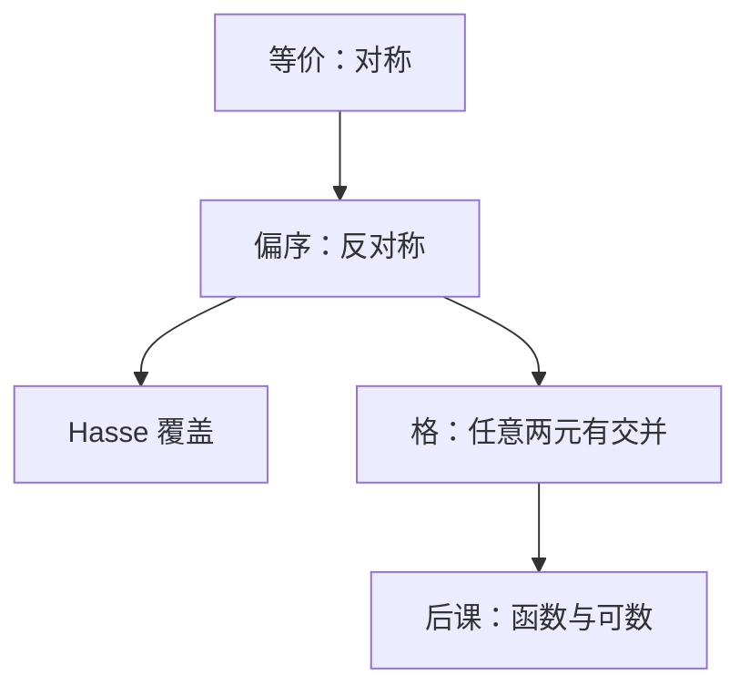

# 偏序与格直觉

可比才谈大小，不可比则并排；若任意两个元都有最小上界与最大下界，这张序就是格。

<footer>—— 据 Rosen, Discrete Mathematics and Its Applications 整理</footer>

上一课[等价关系与划分](/cs/equivalence-partition)钉死了对称的「同一类」。本课不重证划分对应，也不从「序数」另起。缺口是：后课 DAG、包含、布尔代数的 $x\le y$，要的是**反对称**的比较，不是对称的可替换。集合课点过偏序，没有 Hasse、没有交并当运算。

## 问题

等价把互相到达的元粘成一点。序要保留方向：$x\le y$ 且 $y\le x$ 则 $x=y$。缺口因此不是再造有序对，而是：自反、反对称、传递的关系叫做偏序；未必全序——可以有不可比的元。Hasse 图去掉自反与可传递推得的边，只留覆盖关系。

若任意 $x,y$ 都有上确界 $x\vee y$ 与下确界 $x\wedge y$，偏序集是**格**。幂集用 $\subseteq$，交并就是确界：这把[布尔代数](/cs/boolean-algebra)解释成某集合的幂集格，本课只要这个对照，不把门电路请回来。

### 偏序不是拓扑排序本身

拓扑序是把偏序**扩展**成全序（若无环）。本课对象还没有「图上的边当序」；那是 DAG 课。把 Hasse 当成算法流程图，后课会把覆盖与可达混名。

Rosen 用整除偏序与幂集格当主例。整除：$\mathrm{lcm}$ 与 $\gcd$ 是并与交。布尔格的互补律对应上一课程的 $\bar x$。函数与可数下一课才要单射满射。

## 方法

检查三性质。画 Hasse：底小顶大（或反过来，声明即可）。求两元的公共上界中的最小者；不存在则不是格（例如缺了某并）。全序是任意两元可比的偏序。

## 机制

后课类型包含、文件系统目录（若当包含则要小心循环挂载）、知识树本身，都是偏序直觉。格给「最小公共超类型 / 最大公共子类型」一句话：那是 $\vee$/$\wedge$。本课不把格论定理（模格、分配格分类）写进主干；分配性已在布尔公理里用过。

划分的细化按「更细」构成偏序，上一课末句留下的缺口在这里落地：等价关系按包含也成偏序，一般不是全序。

## 边界

本课不引入良基关系上的超限归纳——归纳下一课才从 $\mathbb{N}$ 开始。也不把偏函数、单调函数当重点；函数作为右唯一关系是下一课。电路时序的状态图是有向图，未必是偏序（有环就不是）。

后课默认：谈到 $\le$、包含、整除，先问是否偏序、是否格。编号与双射另说。

## 小结

- 偏序是自反、反对称、传递；允许不可比。
- 格要求任意两元有上、下确界；幂集是标准例子。
- 下一课把关系收成函数，并谈可数。
- 出处：Rosen, *Discrete Mathematics and Its Applications*。
