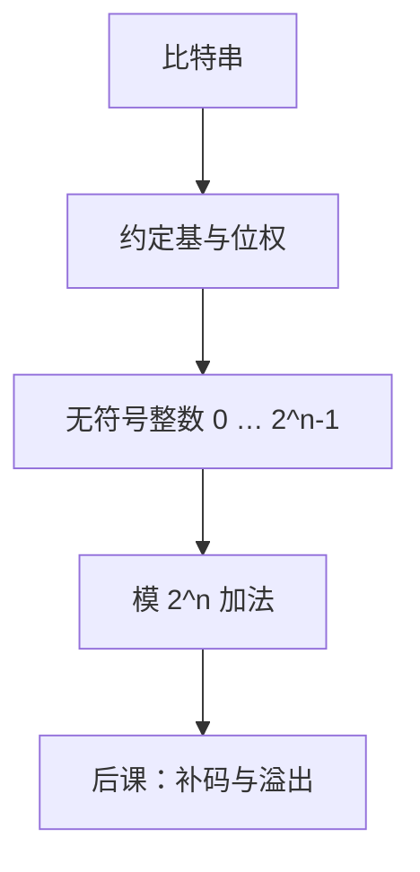

# 进制与位权

同一串符号，只有先约定每一位的权，才变成一个数；权是位置给的，不是符号自己带的。

<footer>—— 据 Knuth, The Art of Computer Programming, Vol. 2；Patterson and Hennessy, Computer Organization and Design (RISC-V) 整理</footer>

上一课[比特作为区分](/cs/bit-as-distinction)钉死了：先有可分辨的二元状态，再谈编码。本课不重讲判决，也不从「十进制怎么写」另起。缺口是：比特串还没有读法。$0110$ 可以是六，也可以是别的东西；没有位权，加法、溢出和后课的补码都没有对象。

## 问题

有了 $\Sigma^n$，比较和复制已经够。要把串当成整数，必须指定基 $b\ge 2$ 和各位的权。否则「进位」没有定义：哪一位满了该往哪送，上一课根本没问。缺口因此不是新的物理区分，而是把串解释成

$$
(a_{n-1}\cdots a_0)_b=\sum_{i=0}^{n-1}a_i b^i,\qquad 0\le a_i<b.
$$

二进制只是 $b=2$、$a_i\in\{0,1\}$。十六进制是给人读的压缩，每四比特一位，不另造字母表。本课只钉无符号位权；负数、小数点都是后课的缺口。

### 位权不是「从左往右念」

日常从高位念起。机器里权是指数：最低位权 $b^0$，最高位权 $b^{n-1}$。端序决定字节怎么排进内存，不改变一个字内部的位权。把端序提前塞进本课，会把表示和存储搅在一起。

Knuth 把位权系统写成一般 $b$ 进。Patterson/Hennessy 在整数算术一章默认二进制无符号，再引入补码。本课停在无符号。

## 方法

固定宽度 $n$。可表示的无符号整数是 $\{0,1,\ldots,2^n-1\}$，一共 $2^n$ 个，与上一课 $|\Sigma^n|$ 相同，只是现在每个串有一个数值。加法按位加、满 $2$ 进一；超出 $2^n-1$ 的进位被丢掉，就是模 $2^n$。本课承认模运算会发生，不把「溢出」定义成有符号的两数同号、和异号——那要等[补码](/cs/twos-complement)。

换基是同一整数的不同写法，不是不同的数。从 $b$ 到 $c$，反复除 $c$ 取余得到新各位。证明用的是带余除法，本课不展开欧几里得算法。

## 机制

位权让电路可以对齐同一权的位再加。全加器吃的是三个同权比特，吐出本位和与向更高权的进位；那是后课加法器的对象，这里只要求权已经排好。固定 $n$ 之后，数值集合有限，相等仍是串相等，因为无符号编码是双射。

$n$ 是资源：字长决定无符号上限。总线一次搬 $n$ 比特，搬的是这个编码，不是「抽象的整数」。后课的指令立即数、地址、偏移，默认都先按无符号或补码读，而不是按十进制读。

## 边界

本课不引入符号位，不把最高位解释成负权。原码、反码、补码是下一课才分的三条路。也不引入小数点：定点只是把某位的权改成 $b^{-k}$，本课连负指数都还没有。Shannon 熵、字符编码都不在这里；串的数值读法与串作为消息的读法不是一回事。

后课默认：谈到无符号整数、地址、掩码，它们是固定宽度的位权编码，加法默认模 $2^n$。

## 小结

- 比特串加上基与位权才成为无符号整数。
- 宽度 $n$ 给出 $\{0,\ldots,2^n-1\}$；加法超出则模 $2^n$。
- 换基不换数；十六进制只是二进制的缩写。
- 符号、溢出语义、定点与浮点都是后课缺口。
- 出处：Knuth, TAOCP Vol. 2；Patterson and Hennessy, *Computer Organization and Design* (RISC-V) 整数表示。
