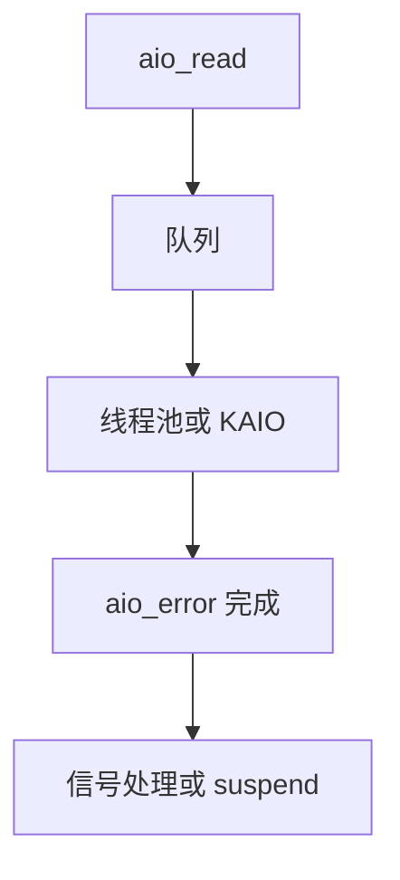

# POSIX AIO

POSIX AIO 用 aiocb 提交读写作，完成再用信号、回调或 aio_error 轮询；Linux 上它长期不是内核真正的异步块路径。

<footer>—— 据 POSIX aio；Linux aio(7) 对 glibc 线程池实现的警告；内核 KAIO 与 io_uring 的对照</footer>

[上一课](/cs/direct-io)仍是调用线程阻塞在 `read` 上（只是不走页缓存）。高并发想「提交后去做别的」。缺口是 **POSIX AIO** 这套接口，以及它在 Linux 上名实不完全相符——为后课 `io_uring`/轮询 I/O 留位置，本课先钉 POSIX 名字。

## 问题

`aio_read` 把 aiocb（fd、偏移、缓冲、字节数）排队，立即返回。完成：`SIGEV_SIGNAL`、`SIGEV_THREAD` 或 `aio_suspend`。缺口：glibc 常用用户态线程池阻塞在 `pread` 上，于是「异步」是线程，不是中断完成。Linux 另有 `io_submit`（KAIO），主要对 `O_DIRECT` 文件真正不阻塞。课序要求分清三套：POSIX API、KAIO、io_uring。本课对象是 POSIX 语义与陷阱。

缓冲 I/O 的 KAIO 常同步回退。信号完成与多线程难写对。教学上把它当可移植接口，性能数字另测。

## 方法

程序填 aiocb，调 `aio_write`。实现或投递内核或派工人线程。与 [预读](/cs/readahead)：异步接口不自动等于预读窗口。与 [fsync](/cs/fsync)：`aio_fsync` 存在，完成才表示那次同步请求结束。对照 `select` 非阻塞 fd：那是「现在能读多少」，不是「盘 I/O 完成」。

## 机制

POSIX AIO 把完成从调用栈上解开，使单线程事件循环能在理论上重叠 I/O。Linux 上若掉进线程池，重叠变成「多阻塞线程」，与用户预期的零拷贝异步不同。这解释了为何数据库与 nginx 一类后来走向 `io_uring` 或自管线程。不要把本课写成网络 aio。

错误：每个 aiocb 自己的 `aio_return`，不能当普通 errno 用完就走。

实现上：glibc AIO 用线程池时，每个 aiocb 可能占一条阻塞线程，连接数一大就打满。KAIO 对缓冲文件常同步完成，看起来像 AIO 却没有重叠。io_uring 是后路，本课只分清名字。 读法上只引用[上一课](/cs/direct-io)的结论，不把对象换成训练推理或限价簿。

本课在操作系统进阶的「文件系统实现 / 接口进阶」课序里，对象是 **POSIX AIO**。

- 先修只引用，不重导：上一课的结论当公理，本课只补差。
- 五栏不吞并：不把本课写成大模型训练/推理，也不写成限价簿或权重量化。
- 文献用 OSTEP、McKusick、内核文档与具名会议论文；不发明 arXiv 编号。

## 边界

本课不把 io_uring 的 SQE 格式写完——[轮询 I/O](/cs/io-polling) 与网络课会再遇真正的异步块层。不保证实时信号队列够用。下一课在「还要经过内核缓冲」时减少拷贝：sendfile 与 splice。

版本字段会变，课序钉的是机制对象「POSIX AIO」，不是某一主线内核的结构体名。
后课默认：POSIX AIO 是完成分离接口，Linux 实现可能是线程。把页在 fd 之间搬而不进用户空间，下一课 sendfile/splice。

## 小结

- POSIX AIO 用 aiocb 异步读写；Linux glibc 常线程化。
- 真正的内核异步多要求 DIRECT 或后来的 uring。
- sendfile/splice 是下一课。
- 出处：POSIX aio；Linux `aio(7)`；Love, *LSP*。
