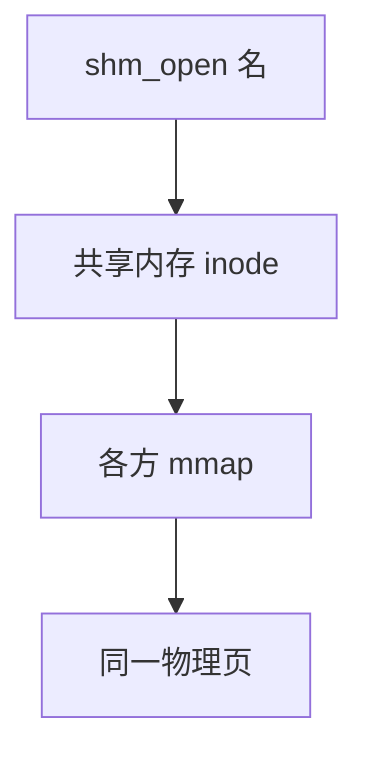

# POSIX 共享内存

shm_open 得到一块命名的共享内存对象，mmap 之后各方 load/store 同一物理页，内核不再拷贝载荷。

<footer>—— 据 POSIX 共享内存；Stevens；Silberschatz 对共享内存 IPC 的整理</footer>

[上一课](/cs/unix-socket)仍把字节拷进内核缓冲。[mmap](/cs/mmap) 已能把文件接到地址空间。[匿名页](/cs/anon-vs-file-page) 说明无文件后备时走交换。缺口是**命名共享内存**：像文件可 `mmap`，又通常不经普通磁盘 FS，供无亲缘进程会合。同步仍要用户自备（后课已有的锁/futex 在用户态用）。

## 问题

管道与 Unix 域的吞吐受拷贝与系统调用限制。共享页：一次映射，之后是内存访问。[COW](/cs/cow-fork) 是私有副本；这里要 `MAP_SHARED`。缺口：`shm_open(name)` 在 shm 命名空间（常挂在 tmpfs）创建对象，`ftruncate` 定长，各方 `mmap`。页按需填零，脏了像匿名或像 tmpfs 文件——实现把它们接到页 Cache 或 shmem。

本课不把 System V `shmget` 的 key 分配写成第二套主干。

对象有模式位，权限检查与普通文件类似。unlink 名字后，已映射者仍可用，直到最后 unmap——类似 inode 链接计数。

## 方法

创建者 `shm_open` + 截断 + mmap。使用者按名打开再 mmap 到自己的 VA，物理帧共享，[TLB](/cs/tlb-translate) 各进程各自翻译到同一 PPN。写立即可见，无内核缓冲边界。互斥：用户放 futex 或信号量在共享页里；内核不管业务锁。

## 机制

POSIX shm 把「文件映射」用在 IPC：命名走 [VFS](/cs/vfs)（tmpfs），数据走页 Cache/匿名 LRU，隔离仍靠各进程页表只映射约定区间。相对套接字：延迟低、无消息边界、错误不会变成 `read` 返回值。过度提交同样适用：映射成功不等于帧已全部在。

不要把这写成绕过权限的教程。

## 边界

本课不引入 memfd、跨 pidfd 密封的全部 Linux 扩展。不保证实时无缺页——首次触碰仍可能缺页。下一课：一个线程要等许多 fd（套接字、管道、设备）上的可读，不能为每个 fd 开线程。

后课默认：大块载荷可共享映射。等待多个描述符就绪，下一课 select/poll。

## 小结

- shm_open + mmap 让无亲缘进程共享物理页。
- 内核不拷贝载荷；同步是用户的责任。
- 多路等待是 select/poll 的缺口。
- 出处：POSIX shared memory；Stevens；Silberschatz et al., *OSC*。
