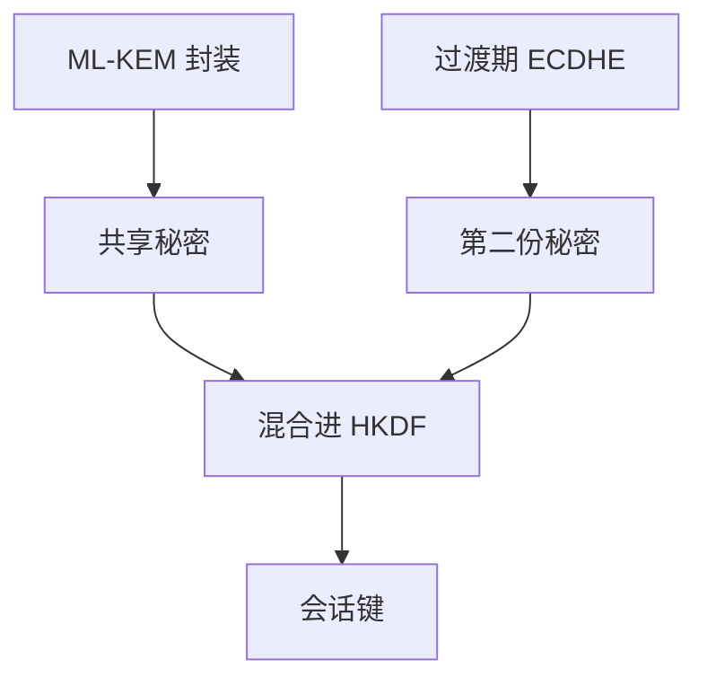

# 后量子 Kyber / Dilithium

Shor 打穿分解与离散对数后，协商要换成 KEM，签名要换成另一类困难问题。ML-KEM（Kyber）与 ML-DSA（Dilithium）是 NIST 标准化的格上候选，不是把 AES 再加长一倍能代替的。

<footer>—— NIST FIPS 203 ML-KEM；FIPS 204 ML-DSA；Regev, LWE；对照[格与 LWE](/cs/lattice-lwe)</footer>

## 定位

上一课[双棘轮](/cs/double-ratchet)的 DH 格在量子模型下不再成立。缺口是**换零件**：KEM 封装共享秘密，Dilithium 签。主干[LWE](/cs/lattice-lwe)已给困难直觉；本课落到标准化名字与混合迁移，不重推最坏到平均。

后课默认已经读完本课钉下的合同，只补差，不从该领域第一性原理重开。

## 问题

ECDH 与 RSA 的长期机密性在大规模量子计算机模型下失败。对称与哈希主要加长。Kyber：封装 32 字节共享秘密；Dilithium：签名体积更大。缺口是协议如何混合：过渡期 ECDHE+Kyber 并行，避免「只部署一种就被其中一种打穿」。

### 不是立刻扔掉 ECC

迁移是多年工程。证书、HSM、代码体积、失败模式都要改。本课不贩卖恐慌时间表。

FIPS 203/204。Kyber 现名 ML-KEM，Dilithium 现名 ML-DSA。本课不发明 arXiv 编号，不写参数攻击步骤。

## 方法

对照 KEM 接口：KeyGen、Encaps、Decaps。签名接口照旧。指出与 HKDF 衔接：KEM 输出仍是 IKM。混合握手：双方都成功才派生。

图中节点是本课的机制骨架；课程不把图展开成可运行的攻击步骤。

## 机制

棘轮仍可在 KEM 上换根，只是「DH 公钥」变成封装密文。身份绑定仍要 PKI 或预共享。格方案公钥和密文更大，带宽与 HSM 固件是工程约束，不是密码分析。

前提写进合同之后，游戏外的误用只当失败模式点名，不在本课写成操作程序。

## 边界

本课不比较全部 NIST 轮次淘汰算法。零知识下一课换问题：证明「知道某秘密」而不泄漏，与 KEM 正交。

## 小结

- DH 棘轮的困难问题可被 Shor 打穿；换 KEM。
- ML-KEM / ML-DSA 是标准化格方案。
- 过渡期混合派生；输出仍进 HKDF。
- 下一课：零知识直觉。
- 出处：NIST FIPS 203、FIPS 204；Regev；对照 Shor 的问题范围。
